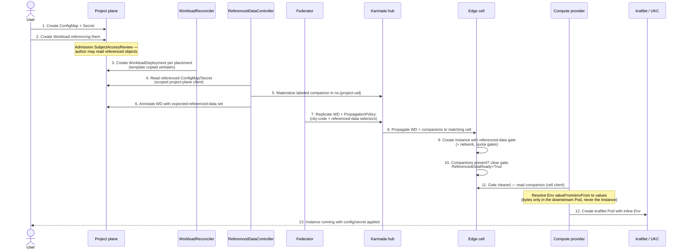

# Mounting ConfigMaps and Secrets into Compute Instances (Unikraft Provider)

> Drafted 2026-05-30, revised 2026-05-31. **This is the foundational referenced-data delivery design for compute, and it ships before [Image Pull Credentials](./image-pull-credentials.md)** — it introduces the resolver, the scoped project-plane client, companion delivery, and the scheduling gate; pull secrets become a later consumer of the same path.

## Table of Contents

- [Summary](#summary)
- [What this enables for users](#what-this-enables-for-users)
- [End-to-end flow](#end-to-end-flow)
- [The two hops](#the-two-hops)
- [Design](#design)
  - [Phase 1 — env injection (ships first)](#phase-1--env-injection-ships-first)
  - [Phase 2 — file mounts (blocked on UKC)](#phase-2--file-mounts-blocked-on-ukc)
  - [The referenced-data resolver](#the-referenced-data-resolver)
  - [Scheduling gate and consumption](#scheduling-gate-and-consumption)
  - [Rotation and restart](#rotation-and-restart)
- [Security](#security)
- [Alternatives](#alternatives)
- [Failure modes](#failure-modes)
- [File-level changes](#file-level-changes)
- [Decisions](#decisions)
- [Open questions](#open-questions)

---

## Summary

A compute `Workload` can already *describe* config/secret mounts — the Instance API
has `Volumes[].ConfigMap/.Secret` (`instance_types.go:292,296`), `VolumeAttachments`
with a `MountPath` (`:206`), and `Env` that parses `ValueFrom` (`:139`). But
describing a mount is all that works. Two independent hops are broken:

1. **Delivery (ours to fix).** The referenced object lives in the user's project
   namespace; the Instance runs on an edge cell. Federation's `PropagationPolicy`
   carries **only `WorkloadDeployment`** (`workloaddeployment_federator.go:284-293`),
   so the data never reaches the cell.
2. **Consumption (split).** Env injection maps onto UKC's inline `Env` and is
   **buildable now**. File mounts need a UKC file-injection API that **does not
   exist** — the same shape of blocker as the registry-auth gap.

This RFC keeps the user contract unchanged (create a ConfigMap/Secret, reference it
by name), resolves it in the management plane, and delivers it to the edge as a
companion object — secret bytes **never enter the Instance spec**. Env injection
ships first; file mounts ship when Unikraft Cloud can accept file content.

## What this enables for users

Today users can only set literal env vars, so config and credentials get baked into
images or pasted as plaintext. After this:

- A user creates a `ConfigMap` and `Secret` in their project and references them
  from the Workload template; the platform delivers the data to every instance in
  every POP cell, without the user knowing federation exists.
- **Secrets stay secret** — values never land in the Workload/Instance spec or the
  projected Instance; they travel only as Secret objects.
- **Phase 1 (env):** keys surface as environment variables — the twelve-factor
  case, no vendor dependency, so it ships first.
- **Phase 2 (files):** a ConfigMap/Secret mounts as files at a path — for config
  files and certs. Same API; lands when Unikraft Cloud supports file injection.

## End-to-end flow

Phase 1, the decided design (management-plane resolution → companion → Karmada →
cell → provider). Management-plane controllers: `WorkloadReconciler`,
`ReferencedDataController`, `WorkloadDeploymentFederator`. The edge cell and the
compute provider run on the POP cell.

## The two hops

**Hop 1 — delivery (ours).** Get the referenced data from the project namespace to
`ns-{project-uid}` on each placed cell, hold the Instance until it lands.

**Hop 2 — consumption.** Env injection lands in UKC's inline `Env` (buildable now).
File mounts are blocked: UKC's `CreateInstanceRequest` exposes `Env`, `Args`, and
`Volumes` (references to empty, pre-created disks) — **no `files`/`user_data`/
metadata field, and no API to put bytes into a volume**. kraftlet's CRD spec *is*
`CreateInstanceRequest`, so it never reads Pod volumes. This is **B1**: Unikraft
Cloud must add file injection (recommended ask: a `files` array of
`{path, content, mode}` on `CreateInstanceRequest`, mirroring cloud-init
`write_files`). Until then, file mounts are rejected/held on the Unikraft provider.

## Design

### Phase 1 — env injection (ships first)

Surface ConfigMap/Secret keys as environment variables.

- **API.** `ValueFrom` already parses. Add `EnvFrom []EnvFromSource` to
  `SandboxContainer` for the bulk form; validate `ValueFrom`/`EnvFrom`
  (`instance_validation.go`).
- **Consumption (provider).** The provider holds an **upstream** (cell) client and
  a **downstream** (kraftlet) client (`instance_controller.go:64-68,80`). Companions
  land on the cell, so the provider reads them via the upstream client, resolves
  `ValueFrom`/`EnvFrom` to values, and inlines them into the kraftlet Pod's `Env`
  (`:189-195`, which today copies only `env.Value`) — not via Pod `ValueFrom` refs,
  which kraftlet doesn't resolve.

### Phase 2 — file mounts (blocked on UKC)

User writes `Volumes[].ConfigMap/.Secret` + `VolumeAttachments[].MountPath`; data
renders as files (key→path, `items`, `defaultMode`, `optional`, read-only) — the
standard Kubernetes projected-volume contract.

- **API gaps to close now (provider-agnostic).** Implement secret-volume validation
  (`instance_validation.go:251`), ConfigMap/Secret `items` projection (forbidden at
  `:341-343`), `defaultMode`/path-safety checks.
- **Reference consumption.** `infra-provider-gcp` already mounts these — ConfigMap →
  cloud-init `write_files`, Secret → Secret Manager + boot script
  (`instance_controller.go:693-731,733-998`) — proving the compute *API* is a
  portable contract. (GCP reads originals from its own upstream rather than using
  companions, because its topology already sits next to them; `items` and env
  `valueFrom` are still TODO there too, `:441`.)
- **Consumption on UKC is blocked on B1.** No acceptable interim workaround:
  base64-env-into-files needs wrapping the user's image and pushes secrets through
  env; pre-populated volumes have no API; baking into the image is the status quo
  this replaces.

### The referenced-data resolver

A new management-plane `ReferencedDataController`:

1. **Collect** every referenced ConfigMap/Secret from the WD template
   (`Env.ValueFrom`, `EnvFrom`, `Volumes`; later `imagePullSecrets`).
2. **Read** via the scoped project-plane client (B3 — this RFC builds it; not the
   quota client, which serves only quota resources).
3. **Materialize** one labeled companion per `(kind, source-name)` in
   `ns-{project-uid}` (`compute.datumapis.com/referenced-data`).
4. **Annotate** the WD with `compute.datumapis.com/expected-referenced-data` (the
   gate contract — propagated to the cell, not reverse-engineered).
5. **Federate.** The federator's PropagationPolicy *always* includes the
   `referenced-data` label selector, so a companion materialized after the policy is
   still picked up — closing the federator-vs-resolver ordering race.

**Fan-out:** one hub companion per `(kind, source-name)`; Karmada replicates it to N
cells — single-write lifecycle. **Ref-counting:** the shared companion tracks
referencing WDs; a WD finalizer deletes it only when the last reference drops (no
cross-cluster owner refs — Karmada GC doesn't honor them). **Single-cluster mode:**
resolver still runs; companion is a local copy, gate clears locally.

### Scheduling gate and consumption

- Add a `compute.datumapis.com/referenced-data` gate at instance creation
  (`stateful_control.go:94-107`) when the template carries any reference.
- **Clearing (new cell-side logic, beside the quota-gate clear at
  `instance_controller.go:233`):** wait for exactly the `expected-referenced-data`
  set, then clear and set `ReferencedDataReady`.
- **Observability:** `ReferencedDataReady` with explicit Reasons (`Resolving`,
  `AwaitingPropagation`, `SourceNotFound`/`SourceUnauthorized`/`SourceTooLarge`,
  `NameMismatch`, `FileMountsUnsupported`, `Ready`) + events + metrics.
- The **provider must honor gates** — today it creates Pods without checking
  `Spec.Controller.SchedulingGates` (`instance_controller.go:58-105`). This RFC adds
  gate-honoring.

### Rotation and restart

Decided: **no auto-roll; explicit restart.** The resolver re-reads sources and
re-materializes the companion on change (latest bytes staged at the edge), but
running instances are not auto-rolled — a fleet-wide mass-roll on every edit is
surprising, and UKC can't mutate a running instance's env anyway.

Content is deliberately **not** folded into the template hash. The restart reuses
existing machinery: template metadata *is* in `ComputeHash` (`controller_utils.go:17-21`),
and the stateful strategy already does an in-place, descending-ordinal,
wait-for-Ready roll when the hash changes (`stateful_control.go:129-139,171-172`).
So a `compute.datumapis.com/restartedAt` template annotation, threaded
`Workload → WD → Instance`, triggers that roll — no new roll engine. (Opt-in
auto-roll via a content hash is a possible future addition.)

## Security

- **Bytes never in user-visible specs.** Workload/Instance specs and the projected
  Instance carry references only. Values live as Secret objects in `ns-{project-uid}`
  and — for env — in the downstream kraftlet Pod (infra-internal, not projected).
- **Companion Secrets stay Secrets** end-to-end; ConfigMap companions carry only
  non-secret config.
- **Authorization (mechanism confirmed).** Admission runs a `SubjectAccessReview`
  for the *submitter* (`AdmissionRequest.UserInfo`) on `get` of each referenced
  object — a direct copy of the Network check (`instance_validation.go:113-131`).
  Prevents naming an object the author couldn't read; the resolver's system identity
  is never the authority.
- **kraftlet Pod boundary.** Inlined env is the cost of UKC's inline-only `Env`. Two
  obligations: the downstream Pod must never be written back to the hub (invariant +
  test), and downstream `ns-{project-uid}` RBAC must be locked to platform
  components. If UKC adds secret-aware env, drop the inlining.
- **Etcd at rest.** Companions exist in etcd on project plane, hub, and each cell;
  presumes encryption-at-rest per plane (same trade-off as image-pull-credentials).

## Alternatives

- **Scoped per-project provider read at the edge (no companions).** Strongest
  alternative — deletes most of this machinery (no companions, ref-counting, PP
  extension, data gate) and is how GCP already works. **Rejected for secret bytes:**
  it requires the shared, lower-trust edge to hold a credential that reads project
  ConfigMaps/Secrets; the resolution boundary staying in the management plane is the
  point. (A config-only hybrid was considered and rejected to avoid two delivery
  mechanisms.)
- **Inline resolved values into the Instance spec.** Rejected — leaks secret bytes
  into etcd everywhere and into the projected Instance.
- **Propagate the user's original objects directly.** Rejected — couples cell
  contents to arbitrary project objects, loses the scoping boundary.
- **A separate controller for pull-secrets.** Rejected — same machinery; pull
  secrets become a thin consumer of this resolver.

## Failure modes

- **Source missing/unauthorized/too large** → gate held, `ReferencedDataReady=False`
  naming the object; `optional` sources skipped.
- **Companion not yet on cell** → gate held (`AwaitingPropagation`), normal transient
  state.
- **Source rotated, instances not rolled** → stale-by-design; surface last-synced
  `resourceVersion` on WD status.
- **File mount on Unikraft (B1 unmet)** → reject at admission or hold with
  `FileMountsUnsupported` (open question), distinct from "still propagating".
- **Single-cluster mode** → local-copy path must be tested; absence of Karmada must
  not silently disable delivery.

## File-level changes

**compute (API + management):**
- `api/v1alpha/instance_types.go` — add `EnvFrom`; align Secret volume struct naming.
- `internal/validation/instance_validation.go` — secret-volume validation (`:251`),
  `items` projection (`:341-343`), `EnvFrom`/`ValueFrom` validation, and the
  referenced-object `SubjectAccessReview` (pattern at `:113-131`).
- new package — **scoped project-plane client** (B3); reused later by
  image-pull-credentials.
- `internal/controller/` — **new `ReferencedDataController`**: collect, read,
  materialize one shared companion per `(kind, source-name)`, annotate the WD,
  ref-count, finalizer cleanup.
- `internal/controller/workloaddeployment_federator.go:284-293` — PropagationPolicy
  always includes the `referenced-data` selector.
- `instancecontrol/scheduling_gates.go` + `stateful_control.go:94-107` — define/add
  the gate; cell-side clearing beside `instance_controller.go:233` with
  `ReferencedDataReady` + reasons/events/metrics.
- restart annotation `compute.datumapis.com/restartedAt` threaded
  `Workload → WD → Instance`.
- `make manifests generate`; tests including the single-cluster path.

**unikraft-provider:**
- `internal/controller/instance_controller.go:58-105` — honor scheduling gates.
- `:189-195` — resolve `ValueFrom`/`EnvFrom` via the cell client; inline into the
  kraftlet Pod `Env`.
- File mounts: reject/hold pending B1.

## Decisions

- **Delivery:** management-plane companions (not scoped-edge-read).
- **Rotation:** no auto-roll; explicit `restartedAt` restart.
- **Gate contract:** explicit `expected-referenced-data` annotation, not recomputed
  names.
- **One resolver, not two:** pull secrets are a later consumer.
- **Sequencing:** ships before image-pull-credentials; owns the scoped client and
  provider gate-honoring.

## Open questions

1. **File-mount UX under B1:** reject at admission, or accept-and-hold with
   `FileMountsUnsupported`?
2. **Scoped client granularity:** can Milo IAM scope the resolver's read to
   types/labels per project namespace, or is it broad `configmaps,secrets:[get,list,watch]`?
3. **Companion size/key limits** and behavior on breach.
4. **`EnvFrom` in v1**, or per-key `ValueFrom` only for the first release?
5. **VM runtime** consumption — out of scope for Unikraft (sandbox-only); confirm
   deferral.
