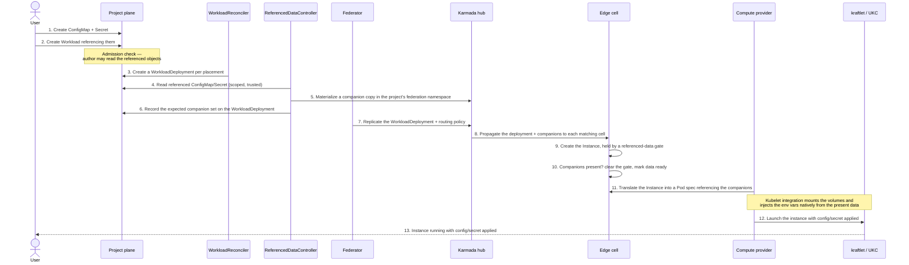

# Mounting ConfigMaps and Secrets into Compute Instances (Unikraft Provider)

> Drafted 2026-05-30, revised 2026-05-31. **This is the foundational referenced-data delivery design for compute, and it ships before [Image Pull Credentials](./image-pull-credentials.md)** — it introduces the resolver, companion delivery, and the scheduling gate; pull secrets become a later consumer of the same path.

## Table of Contents

- [Summary](#summary)
- [What this enables for users](#what-this-enables-for-users)
- [End-to-end flow](#end-to-end-flow)
- [The gap: cross-plane delivery](#the-gap-cross-plane-delivery)
- [Design](#design)
  - [The referenced-data resolver](#the-referenced-data-resolver)
  - [Consumption on the provider](#consumption-on-the-provider)
  - [Scheduling gate](#scheduling-gate)
  - [Rotation and restart](#rotation-and-restart)
- [Security](#security)
- [Alternatives](#alternatives)
- [Failure modes](#failure-modes)
- [What gets built](#what-gets-built)
- [Decisions](#decisions)
- [Open questions](#open-questions)

---

## Summary

A compute `Workload` can already *describe* config and secret mounts: a volume
sourced from a ConfigMap or Secret, a container attachment with a mount path, and
environment variables that reference a key. The runtimes can already *consume* them —
the Unikraft runtime runs instances from Pod specs through its kubelet integration,
which honors ConfigMap/Secret references as both environment variables and volume
mounts, and the GCP provider mounts them as files too. So the API is real and the
runtimes support it.

The one thing missing is in the middle: **the referenced data never reaches the cell
where the instance runs.** It lives in the user's project; the instance runs on an
edge cell; federation propagates only the `WorkloadDeployment`. The instance comes up
referencing data that isn't there.

This RFC closes that gap. It keeps the user contract unchanged (create a
ConfigMap/Secret, reference it by name), resolves the reference in the trusted
management plane, and delivers the data to the edge as a derived companion object —
secret bytes **never enter the Workload or Instance spec**. Both environment
variables and file mounts work, because once the data is present the runtime's
existing Pod-spec consumption handles the rest.

## What this enables for users

Today users can only set literal environment variables, so configuration and
credentials get baked into images or pasted in as plaintext. After this:

- A user creates a `ConfigMap` and `Secret` in their project and references them
  from the Workload; the platform delivers that data to every instance in every POP
  cell, without the user ever knowing federation exists.
- **Both forms work** — keys surfaced as environment variables (the twelve-factor
  case) and ConfigMaps/Secrets mounted as files at a path (config files,
  certificates).
- **Secrets stay secret** — values never appear in the Workload or Instance the user
  sees; they travel only as Secret objects.

## End-to-end flow

The decided design: management-plane resolution → companion object → federation →
cell → provider. The `WorkloadReconciler`, `ReferencedDataController`, and
`Federator` run in the management plane; the edge cell and the compute provider run
on the POP cell.

## The gap: cross-plane delivery

The referenced ConfigMap/Secret lives in the user's project namespace; the instance
runs on an edge cell, possibly thousands of miles away. The federation channel
carries only the `WorkloadDeployment`, so the data has no path to the cell. There is
also no gate guarding this — the instance isn't even held back; it simply launches
with the reference unresolved.

Consumption is *not* a gap: the Unikraft runtime's kubelet integration already
resolves ConfigMap/Secret references in a Pod spec — env vars and volume mounts
alike — provided the referenced objects are present where it resolves them. So the
whole problem is getting the data to the cell, and faithfully carrying the
references through into the Pod spec the runtime consumes.

## Design

### The referenced-data resolver

A new management-plane controller is the heart of delivery. For each
WorkloadDeployment it:

1. **Collects** every ConfigMap/Secret the template references — environment
   references and volume sources today; image pull secrets later.
2. **Reads** them with a scoped, trusted project-plane identity. The management plane
   already has legitimate project access, so broad project-secret read never leaves
   it.
3. **Materializes** one labeled companion per referenced object in the project's
   federation namespace.
4. **Records** the expected companion set on the WorkloadDeployment, so the cell
   knows exactly what to wait for rather than guessing.
5. **Routes** companions to cells by extending the existing federation routing policy
   to carry the labeled companions alongside the deployment.

One companion exists per referenced object and is replicated to each placed cell — a
single object to create, update, and delete. When several deployments reference the
same object the companion is shared and reference-counted, removed only when the last
reference goes away. In single-cluster mode the same resolver runs and the companion
is simply a local copy.

### Consumption on the provider

Once the companions are present on the cell, the provider translates the Instance
into the Pod spec the runtime consumes — carrying the volume sources, volume mounts,
and environment references through faithfully and pointing them at the delivered
companions, with the referenced data present in the namespace the runtime resolves
from. The kubelet integration then mounts the volumes and injects the environment
variables natively; there is no provider-side inlining of secret values. (The
provider does not do this faithful translation today — it drops volumes and copies
only literal env values — so this is the provider-side work this RFC covers. The GCP
provider performs the equivalent translation already, which is why the same Workload
runs on either substrate.)

### Scheduling gate

An instance that references any ConfigMap/Secret is held by a **referenced-data
scheduling gate**, alongside the existing network and quota gates. The cell clears it
once exactly the expected companion set is present, and surfaces a
`ReferencedDataReady` status with clear reasons — resolving, awaiting propagation,
source not found, source unauthorized, source too large, or ready — backed by events
and metrics so a held instance is diagnosable, not a silent hang. The compute
provider must respect scheduling gates so an instance is never launched with its data
missing; this RFC adds that behavior.

### Rotation and restart

Decided: **no automatic roll; an explicit restart instead.** When a source changes,
the resolver re-reads it and refreshes the companion, so the latest values are staged
at the edge for the next instance launch. Running instances are not rolled
automatically — a fleet-wide restart on every edit is surprising, and a running
instance's environment isn't mutated in place regardless.

Compute already performs ordered, in-place rolling updates when a Workload's template
changes. The restart reuses that: a conventional restart annotation on the template
rolls the instances, which pick up the refreshed values — no new machinery. An
opt-in automatic roll on content change is a possible future addition, not part of
this RFC.

## Security

- **Bytes never in user-visible specs.** The Workload and the Instance the user sees
  carry references only. Values exist as Secret objects in the project's federation
  namespace and on the cell where the runtime mounts them — never in anything
  projected back to the user.
- **Companion Secrets stay Secrets** end to end; ConfigMap companions carry only
  non-secret config. The runtime mounts the companions directly, so the provider
  never has to inline secret values itself.
- **Authorization.** Admission verifies the submitting user can read each referenced
  object — the same check already used for referenced Networks. A user cannot pull in
  an object they couldn't read themselves; the resolver's system identity is never
  the authority.
- **Trust boundary at the edge.** Resolving in the management plane is deliberate, so
  the shared, lower-trust edge never holds a credential that can read project
  ConfigMaps/Secrets. Companions are isolated per project namespace on each cell.
- **At rest.** Companions live in storage on the project plane, the hub, and each
  cell; this presumes encryption at rest on every plane.

## Alternatives

- **Let the provider read the originals from the edge (no companions).** The leanest
  option — it removes the resolver, companions, routing changes, and the data gate,
  and it is how the GCP provider already works. **Rejected for secret bytes:** it
  requires the shared edge to hold a credential that reads project ConfigMaps and
  Secrets, exactly the trust boundary this design keeps in the management plane. (A
  config-only hybrid was considered and rejected to avoid maintaining two delivery
  paths.)
- **Inline resolved values into the Instance.** Rejected — leaks secret bytes into
  storage everywhere and into what the user sees.
- **Propagate the user's original objects directly.** Rejected — couples cell
  contents to arbitrary project objects and loses the scoping boundary.
- **A separate controller for pull secrets.** Rejected — same machinery; pull secrets
  become a thin consumer of this resolver instead.

## Failure modes

- **Source missing, unauthorized, or too large** → gate held, status names the
  offending object; optional sources are skipped.
- **Companion not yet on the cell** → gate held (awaiting propagation); a normal
  transient state during placement.
- **Source changed, instances not rolled** → stale by design until restarted;
  last-synced state is surfaced so it's observable.
- **Single-cluster mode** → the local-copy path must be exercised so the absence of
  federation never silently disables delivery.

## What gets built

- A **referenced-data resolver** in the management plane: collect, read, materialize,
  reference-count, and clean up companions.
- A **scoped project-plane read identity** for the resolver (built here; reused later
  by image pull credentials).
- **Federation routing** extended to carry companions to the same cells as the
  deployment.
- A **referenced-data scheduling gate**, cell-side clearing, and the
  `ReferencedDataReady` status with reasons, events, and metrics.
- **API additions**: a bulk "import all keys" env form, and completing volume
  validation (secret volumes, key→path selection, file mode).
- **Provider changes**: respect scheduling gates, and faithfully translate the
  Instance's volumes, mounts, and env references into the Pod spec the runtime
  consumes.
- A **restart** path (a conventional template annotation) so a rotated source can be
  picked up on demand.

## Decisions

- **Delivery:** management-plane companions (not edge-read).
- **Rotation:** no auto-roll; explicit restart.
- **Gate contract:** an explicit expected-companion set recorded on the deployment,
  not guessed.
- **One resolver, not two:** pull secrets are a later consumer.
- **Sequencing:** ships before image pull credentials; owns the scoped read identity
  and provider gate-honoring.

## Open questions

1. **Scoped-read granularity:** can the resolver's project read be scoped to specific
   object types or labels, or is it broad config/secret read?
2. **Companion size limits** and behavior when exceeded.
3. **Bulk env import in v1**, or per-key references only for the first release?
4. **VM runtime** consumption — out of scope for Unikraft (sandbox-only); confirm
   deferral.
