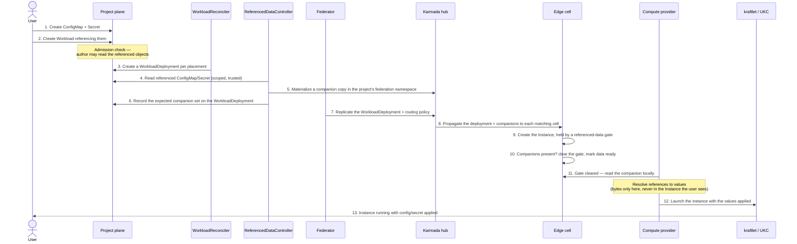

# Mounting ConfigMaps and Secrets into Compute Instances (Unikraft Provider)

> Drafted 2026-05-30, revised 2026-05-31. **This is the foundational referenced-data delivery design for compute, and it ships before [Image Pull Credentials](./image-pull-credentials.md)** — it introduces the resolver, companion delivery, and the scheduling gate; pull secrets become a later consumer of the same path.

## Table of Contents

- [Summary](#summary)
- [What this enables for users](#what-this-enables-for-users)
- [End-to-end flow](#end-to-end-flow)
- [The two hops](#the-two-hops)
- [Design](#design)
  - [Phase 1 — env injection (ships first)](#phase-1--env-injection-ships-first)
  - [Phase 2 — file mounts (blocked on Unikraft Cloud)](#phase-2--file-mounts-blocked-on-unikraft-cloud)
  - [The referenced-data resolver](#the-referenced-data-resolver)
  - [Scheduling gate and consumption](#scheduling-gate-and-consumption)
  - [Rotation and restart](#rotation-and-restart)
- [Security](#security)
- [Alternatives](#alternatives)
- [Failure modes](#failure-modes)
- [What gets built](#what-gets-built)
- [Decisions](#decisions)
- [Open questions](#open-questions)

---

## Summary

A compute `Workload` can already *describe* config and secret mounts: a volume
sourced from a ConfigMap or Secret, a container attachment with a mount path, and
environment variables that reference a key. But describing a mount is all that works
today. Two independent hops are broken:

1. **Delivery (ours to fix).** The referenced ConfigMap/Secret lives in the user's
   project; the instance runs on an edge cell. Federation propagates only the
   `WorkloadDeployment`, so the data never reaches the cell — the instance comes up
   referencing data that isn't there.
2. **Consumption (split).** Surfacing keys as environment variables maps onto what
   Unikraft Cloud already accepts and is **buildable now**. Mounting data as files
   needs a file-injection capability Unikraft Cloud **does not have yet** — the same
   shape of blocker as private-registry credentials.

This RFC keeps the user contract unchanged (create a ConfigMap/Secret, reference it
by name), resolves the reference in the trusted management plane, and delivers the
data to the edge as a derived companion object — secret bytes **never enter the
Workload or Instance spec**. Environment-variable injection ships first; file mounts
ship when Unikraft Cloud can accept file content.

## What this enables for users

Today users can only set literal environment variables, so configuration and
credentials get baked into images or pasted in as plaintext. After this:

- A user creates a `ConfigMap` and `Secret` in their project and references them
  from the Workload; the platform delivers that data to every instance in every POP
  cell, without the user ever knowing federation exists.
- **Secrets stay secret** — values never appear in the Workload or Instance the user
  sees; they travel only as Secret objects.
- **Phase 1 (env):** keys surface as environment variables — the twelve-factor case,
  with no vendor dependency, so it ships first.
- **Phase 2 (files):** a ConfigMap/Secret mounts as files at a path — for config
  files and certificates. Same API; lands when Unikraft Cloud supports file
  injection.

## End-to-end flow

Phase 1, the decided design: management-plane resolution → companion object →
federation → cell → provider. The `WorkloadReconciler`, `ReferencedDataController`,
and `Federator` run in the management plane; the edge cell and the compute provider
run on the POP cell.

## The two hops

**Hop 1 — delivery (ours).** Move the referenced data from the user's project to
each cell where the workload is placed, and hold the instance until it arrives.

**Hop 2 — consumption.** Environment variables map onto what Unikraft Cloud's
instance API already accepts. File mounts do not: that API accepts environment
variables and references to pre-created, empty volumes, but offers **no way to inject
file content or populate a volume with data**. This is **B1** — Unikraft Cloud must
add file injection (recommended ask: accept a set of files, each with a path,
content, and mode, at instance-create time). Until then, file mounts are
rejected or held on the Unikraft provider; the user-facing API is identical, so
nothing changes for users when the capability lands.

## Design

### Phase 1 — env injection (ships first)

Surface ConfigMap/Secret keys as environment variables inside the instance. Per-key
references already exist in the API; add the bulk "import all keys" form to match
what users expect. The provider reads the delivered companion on the cell, resolves
the references to concrete values, and passes them to the instance as environment
variables.

### Phase 2 — file mounts (blocked on Unikraft Cloud)

A user sources a volume from a ConfigMap/Secret and attaches it at a mount path; the
data renders as files — the familiar contract of selecting specific keys to paths,
setting file mode, and marking a source optional. This is **provider-agnostic API
work that can land now** (completing validation for secret volumes, key→path
selection, and file mode), even though consumption on Unikraft is blocked on B1.

That the API is a portable contract is already proven: the GCP provider mounts
ConfigMaps and Secrets as files today. It does so by reading the originals from its
own environment rather than using companions — its topology already sits next to
them — which is why the companion mechanism is specific to the federated edge, not
universal.

No interim workaround is acceptable on Unikraft: encoding files into environment
variables requires wrapping the user's image and pushes secret bytes through the
environment; pre-populating a volume has no API; baking config into the image is the
status quo this feature replaces.

### The referenced-data resolver

A new management-plane controller is the heart of delivery. For each
WorkloadDeployment it:

1. **Collects** every ConfigMap/Secret the template references (env references and
   volume sources today; image pull secrets later).
2. **Reads** them with a scoped, trusted project-plane identity — the management
   plane already has legitimate project access, so broad project-secret read never
   leaves it.
3. **Materializes** one labeled companion per referenced object in the project's
   federation namespace.
4. **Records** the expected companion set on the WorkloadDeployment, so the cell
   knows exactly what to wait for rather than guessing.
5. **Routes** companions to cells by extending the existing federation routing policy
   to carry the labeled companions alongside the deployment.

One companion exists per referenced object and is replicated to each placed cell —
a single object to create, update, and delete. When several deployments reference
the same object the companion is shared and reference-counted, removed only when the
last reference goes away. In single-cluster mode the same resolver runs and the
companion is simply a local copy.

### Scheduling gate and consumption

An instance that references any ConfigMap/Secret is held by a **referenced-data
scheduling gate**, alongside the existing network and quota gates. The cell clears
it once exactly the expected companion set is present, and surfaces a
`ReferencedDataReady` status with clear reasons — resolving, awaiting propagation,
source not found, source unauthorized, source too large, file mounts unsupported, or
ready — backed by events and metrics so a held instance is diagnosable, not a silent
hang. The compute provider must respect scheduling gates so an instance is never
launched with its data missing; this RFC adds that behavior.

### Rotation and restart

Decided: **no automatic roll; an explicit restart instead.** When a source changes,
the resolver re-reads it and refreshes the companion, so the latest values are staged
at the edge for the next instance launch. Running instances are not rolled
automatically — a fleet-wide restart on every edit is surprising, and Unikraft Cloud
can't change a running instance's environment anyway.

Compute already performs ordered, in-place rolling updates when a Workload's template
changes. The restart reuses that: a conventional restart annotation on the template
rolls the instances, which pick up the refreshed values — no new machinery. An
opt-in automatic roll on content change is a possible future addition, not part of
this RFC.

## Security

- **Bytes never in user-visible specs.** The Workload and the Instance the user sees
  carry references only. Values exist as Secret objects in the project's federation
  namespace and, for environment injection, momentarily inside the provider's
  internal launch request — never in anything projected back to the user.
- **Companion Secrets stay Secrets** end to end; ConfigMap companions carry only
  non-secret config.
- **Authorization.** Admission verifies the submitting user can read each referenced
  object — the same check already used for referenced Networks. A user cannot pull in
  an object they couldn't read themselves; the resolver's system identity is never
  the authority.
- **Trust boundary at the edge.** Resolving in the management plane is deliberate, so
  the shared, lower-trust edge never holds a credential that can read project
  ConfigMaps/Secrets. Companions are isolated per project namespace on each cell.
- **At rest.** Companions live in storage on the project plane, the hub, and each
  cell; this presumes encryption at rest on every plane.

## Alternatives

- **Let the provider read the originals from the edge (no companions).** The leanest
  option — it removes the resolver, companions, routing changes, and the data gate,
  and it is how the GCP provider already works. **Rejected for secret bytes:** it
  requires the shared edge to hold a credential that reads project ConfigMaps and
  Secrets, exactly the trust boundary this design keeps in the management plane. (A
  config-only hybrid was considered and rejected to avoid maintaining two delivery
  paths.)
- **Inline resolved values into the Instance.** Rejected — leaks secret bytes into
  storage everywhere and into what the user sees.
- **Propagate the user's original objects directly.** Rejected — couples cell
  contents to arbitrary project objects and loses the scoping boundary.
- **A separate controller for pull secrets.** Rejected — same machinery; pull secrets
  become a thin consumer of this resolver instead.

## Failure modes

- **Source missing, unauthorized, or too large** → gate held, status names the
  offending object; optional sources are skipped.
- **Companion not yet on the cell** → gate held (awaiting propagation); a normal
  transient state during placement.
- **Source changed, instances not rolled** → stale by design until restarted;
  last-synced state is surfaced so it's observable.
- **File mount requested on Unikraft (B1 unmet)** → rejected at admission or held with
  a clear "file mounts unsupported" reason, distinct from "still propagating."
- **Single-cluster mode** → the local-copy path must be exercised so the absence of
  federation never silently disables delivery.

## What gets built

- A **referenced-data resolver** in the management plane: collect, read, materialize,
  reference-count, and clean up companions.
- A **scoped project-plane read identity** for the resolver (built here; reused later
  by image pull credentials).
- **Federation routing** extended to carry companions to the same cells as the
  deployment.
- A **referenced-data scheduling gate**, cell-side clearing, and the
  `ReferencedDataReady` status with reasons, events, and metrics.
- **API additions**: the bulk env-import form, and completing volume validation
  (secret volumes, key→path selection, file mode) for Phase 2.
- **Provider changes**: respect scheduling gates, and resolve references into instance
  environment variables.
- A **restart** path (a conventional template annotation) so a rotated source can be
  picked up on demand.

## Decisions

- **Delivery:** management-plane companions (not edge-read).
- **Rotation:** no auto-roll; explicit restart.
- **Gate contract:** an explicit expected-companion set recorded on the deployment,
  not guessed.
- **One resolver, not two:** pull secrets are a later consumer.
- **Sequencing:** ships before image pull credentials; owns the scoped read identity
  and provider gate-honoring.

## Open questions

1. **File-mount UX under B1:** reject at admission, or accept and hold with a clear
   reason?
2. **Scoped-read granularity:** can the resolver's project read be scoped to specific
   object types or labels, or is it broad config/secret read?
3. **Companion size limits** and behavior when exceeded.
4. **Bulk env import in v1**, or per-key references only for the first release?
5. **VM runtime** consumption — out of scope for Unikraft (sandbox-only); confirm
   deferral.
