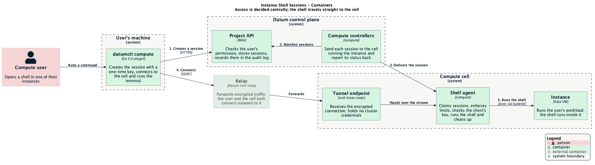
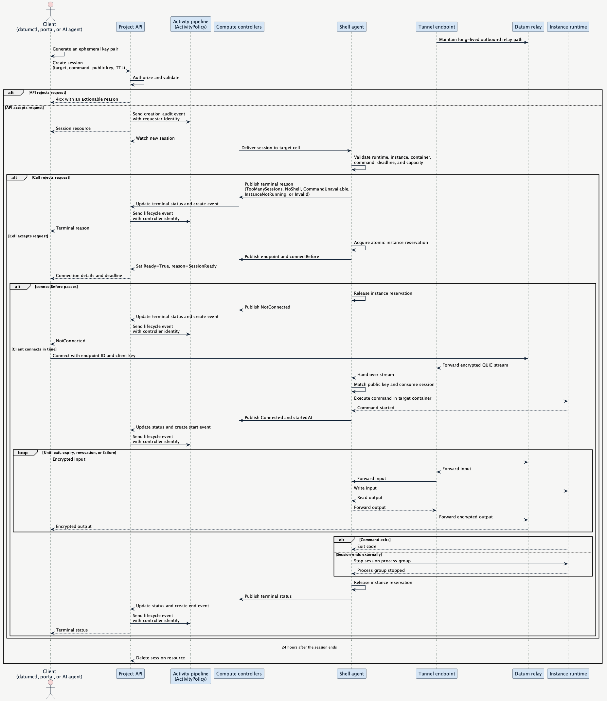

# Instance shell sessions

**Status:** Provisional
**Related:** [CLI-first Compute experience](https://github.com/datum-cloud/enhancements/issues/823)
(which set this capability aside for separate tracking) ·
[Runtime Classes](../runtime-classes/README.md) (how a class advertises what it
supports) · [Federated Deployment Scheduling](../federated-deployment-scheduling.md)
(how work reaches the cell that runs an instance)

---

- [Summary](#summary)
- [Motivation](#motivation)
  - [Goals](#goals)
  - [Non-goals](#non-goals)
- [Proposal](#proposal)
  - [What it looks like](#what-it-looks-like)
  - [User stories](#user-stories)
  - [Architecture](#architecture)
  - [Guardrails](#guardrails)
  - [Risks and mitigations](#risks-and-mitigations)
- [Design details](#design-details)
- [Production readiness review questionnaire](#production-readiness-review-questionnaire)
- [Implementation history](#implementation-history)
- [Drawbacks](#drawbacks)
- [Alternatives](#alternatives)
- [Infrastructure needed](#infrastructure-needed)

## Summary

Let users and customer-controlled AI agents open a live shell or run a one-off
command inside a running instance to inspect its state and diagnose problems.

## Motivation

When an instance misbehaves, users today can see its status and logs but cannot
look inside it. Checking a file, testing a connection or running a quick
command means changing and redeploying the workload, which is slow and can
hide the problem being investigated.

Getting into a running instance is something every major hosting platform
offers. Without it, Datum Compute feels hard to debug, especially for users who
have found a problem in the portal and have nowhere to go from there.

### Goals

- A user or customer-controlled AI agent with the right permission can run an
  interactive shell or one-off command in a running general-purpose (Kata) or
  unikernel (Unikraft) instance. Both runtimes use the same API and client
  workflow when the runtime and image meet the session requirements.
- The p95 time from accepted session creation to an interactive prompt or
  noninteractive process start is less than five seconds on supported
  production networks.
- The project activity log provides a complete history of session access.
- Every session ends with an actionable explanation.
- When a session ends, the platform stops every process that it started. File
  writes and other changes inside the instance remain until the instance is
  replaced.

### Non-goals

- The virtual machine runtime class.
- Attaching to an instance's main process, port forwarding or file transfer.
- Recording the contents of a session (keystrokes and output).

## Proposal

### What it looks like

```
$ datumctl compute exec web-0 -- sh
/ # cat /etc/app/config.yaml
/ # exit
```

In the Cloud Portal, an instance's page gets an **Open shell** action that opens
a terminal in the browser.

*Illustrative only; exact commands and UI are to be designed.*

### User stories

#### A developer inspects a misbehaving instance

A developer sees that an API fails in one location. They choose an affected
instance, open a shell and trace the problem to a stale configuration file and
a failing DNS lookup.

#### A customer's AI agent investigates a failure

A customer-controlled AI agent detects a failed health check, creates a session
through the API with its project service identity, runs a targeted diagnostic
command and reports its findings.

### Architecture

After session creation, command traffic travels straight from the client to the
cell that runs the instance. Traffic is encrypted end to end, the control plane
is not in the data path and cells accept no inbound connections.

Status travels the other way without any cell reaching outward. The shell
agent writes session status to its own cell's copy only. Karmada's status
sync, the same reflection and aggregation compute already uses for
`WorkloadDeployment`, carries that status to the hub copy without the agent
holding hub credentials or making a hub call. The compute controllers copy
status from the hub to the project's session. Measured on real Kata cells
running under Karmada, a session reaches `Ready` in 0.14–0.26 seconds. Revoke,
client disconnect and expiry all killed background and disowned jobs in every
run.



Source: [c4-container-diagram.puml](./c4-container-diagram.puml)

#### End-to-end flow

The client can be `datumctl`, the Cloud Portal or a customer-controlled AI
agent. Each uses the same API and data path.



Source: [sequence-diagram.puml](./sequence-diagram.puml)

### Guardrails

- **Permission on session creation:** Creating `InstanceConsoleSession`
  resources requires the new session-create permission. The default
  project-admin role gets it; viewer roles do not. AI agent identities require
  an explicit grant
- **Single-use session:** The first authenticated connection consumes the
  session and can run only the requested command. The agent rejects replays and
  command changes; deleting the session closes an active connection
- **Short-lived:** The cell gives clients a 60-second connection window and
  limits command execution to one hour
- **Per-instance limit:** At most three sessions can run in an instance at once
- **Session quota:** The quota system limits how many sessions a project can
  hold open, checked when a session is created. The default is zero, so a
  project can open sessions only once it is granted an allowance
- **Isolation:** Cell network policy lets the tunnel endpoint reach only its
  agent

### Risks and mitigations

- **Misconfigured authorization grants broad access:** Test default role
  bindings and alert operators to unusual session volume
- **The client private key grants access:** Keep CLI keys in process memory
  only. The browser client must hold the raw key in its worker memory for the
  Go iroh library. Never write it to browser storage, and clear it when the
  terminal closes
- **Client library maintenance depends on one person:** Pin the Go iroh version;
  test it against the Rust tunnel endpoint in CI; keep a small Rust helper as a
  fallback
- **Relay distance can miss the five-second p95 goal:** Review relay placement
  and capacity; do not enable preview in a region until staging meets the goal
- **Automated clients can overload session control paths:** Enforce the
  project session quota and per-instance limit; alert on sustained quota
  denials
- **The browser client is a large download:** Load it only when a terminal opens
  (about 3 MB compressed); cache it between visits
- **A Datum Connect regression breaks shells:** Qualify each release in CI
  before rolling it out to cells
- **Security review:** Review the key, isolation and cleanup model with the
  platform security owners before preview

## Design details

### Proposed API

`InstanceConsoleSession` is a project-scoped
`compute.datumapis.com/v1alpha` resource. A client creates one resource for one
command in one container. Deleting it revokes the session.

```yaml
apiVersion: compute.datumapis.com/v1alpha
kind: InstanceConsoleSession
metadata:
  # Clients use generateName because each resource represents one invocation.
  generateName: web-0-
spec:
  # The whole spec is immutable. To change a request, delete it and create one.

  # Required name and UID of an Instance in the same project. The UID prevents
  # the session from reaching a replacement Instance that reused the name.
  instanceRef:
    name: web-0
    uid: 3d39d44d-93fb-4d78-a14a-d76a9876aa71

  # Required exact container name. Clients fill this automatically when the
  # Instance has one container and require a choice when it has several.
  containerName: app

  # Required argument vector, not a shell string. It accepts 1–64 elements and
  # at most 16 KiB in total. The image must contain this executable and a
  # supported shell, which the agent uses to manage the process group.
  command: ["sh"]

  # Optional; defaults to false. Keeps standard input open when true, including
  # without a terminal.
  stdin: true

  # Optional; defaults to false. Allocates a pseudoterminal and merges output
  # streams when true. false preserves separate standard output and error.
  terminal: true

  # Required 32-byte iroh public key as 64 lowercase hexadecimal characters.
  # The private key remains in client memory and never enters the API.
  clientPublicKey: "0123456789abcdef0123456789abcdef0123456789abcdef0123456789abcdef"

  # Optional command lifetime, measured from startedAt. Defaults to 15m and
  # cannot exceed 1h.
  ttl: 15m
status:
  # All status fields are output only.
  connection:
    # Public endpoint identity and relay addresses; neither is a bearer secret.
    endpointID: "abcdef0123456789abcdef0123456789abcdef0123456789abcdef0123456789"
    relayURLs:
      - https://iroh-relay.us-central-1.datumconnect.net
    # host:port the client names when it opens the tunnel stream.
    target: exec-agent-0.exec-agent.compute-shell-system.svc.cluster.local:7777

  # Absolute deadline set from the shell agent's clock when it publishes the
  # connectable status. Status propagation consumes part of the 60-second
  # window, so clients should connect immediately.
  connectBefore: "2026-09-29T18:01:00Z"

  # Set when the command starts and calculated as startedAt plus spec.ttl.
  # startedAt: "2026-09-29T18:00:10Z"
  # expiresAt: "2026-09-29T18:15:10Z"

  # Set only once the platform confirms every process the session started has
  # stopped, not when the terminal reason first appears. A revoked or
  # lost-cell session can show its terminal reason before this is set, or
  # never get one at all if cleanup goes unconfirmed.
  # endedAt: "2026-09-29T18:04:32Z"

  # Set only when the runtime reports a normal process exit. datumctl returns
  # this value; without one, it returns nonzero and shows the condition reason.
  # exitCode: 0

  # Ready is Unknown while pending, True while connectable or connected, and
  # False after rejection or termination. reason identifies the exact phase.
  conditions:
    - type: Ready
      status: "True"
      reason: SessionReady
      message: "Connect before 2026-09-29T18:01:00Z"
      lastTransitionTime: "2026-09-29T18:00:01Z"
      observedGeneration: 1
```

### Session lifecycle

A session moves through `Pending`, `SessionReady` and `Connected`, then reaches
one immutable terminal state. Terminal reasons are `Completed`, `Expired`,
`Revoked`, `NotConnected`, `AgentShutdown`, `AgentLost`, `TooManySessions`,
`NoShell`, `CommandUnavailable`, `InstanceNotRunning`, `InstanceNotFound`,
`Invalid`, `Unavailable`, `Disconnected` and `ClosedByUser`. `Unavailable`
ends a session that no cell takes within 30 seconds. `ClosedByUser` ends a
session whose client closed it on purpose before the command exited, by
sending a WebSocket close frame; the portal's Close shell and `datumctl` on an
interrupt do. `Disconnected` ends a session whose connection was lost without
one; the agent notices within 20 seconds. The client uses the condition reason to distinguish a session
waiting for a connection from one whose command is running. `AgentLost` also
covers a session whose bound cell stops reporting altogether — deregistered,
or the instance moved to another cell. That session ends and its reservation
and quota are released immediately: there is no cell left to ask for cleanup,
so the five-minute confirmation wait described below does not apply.

Deleting an active session revokes it. The controller sets the terminal
reason right away so the client learns the outcome without waiting on the
cell, then annotates the hub copy to ask the cell to revoke the session.
`endedAt` is a separate, honest signal: it is set only once the agent
confirms the process group has stopped, not when the terminal reason first
appears. A finalizer waits up to five minutes for that confirmation before
the controller deletes the hub copy; Karmada deletes the propagated cell copy
as soon as the hub copy is gone, without waiting for the agent to finish
cleanup, so the controller cannot delete the hub copy first and confirm
cleanup after. If the agent does not confirm within five minutes, the
controller records `CleanupUnconfirmed`, deletes the hub copy anyway and
removes the finalizer without ever setting `endedAt`. This cleanup outcome is
a lifecycle event, not a replacement for the immutable terminal reason.

The controller deletes a session as soon as it reaches a terminal state and its
end event is recorded, which releases its quota. A connected client receives
the ending reason and exit code in the stream's closing message. A client whose
session ended before it connected reads them from the session's final state.
Audit records outlive the resource.

### Runtime and routing

- **Runtime capability.** Runtime classes advertise the `exec` feature, and
  sessions for classes without it are refused. The agent also checks that the
  selected image contains a supported shell and the requested executable
  before accepting a session:
  - **General-purpose (Kata):** The runtime supports exec natively.
  - **Unikernel (Unikraft):** The Unikraft exec plugin is on by default for
    every instance. The provider's exec policy is `always` in every cell that
    runs unikernel instances.
- **Routing.** Instances record which cell runs them, and sessions follow the
  same federation path as the workloads they target.
- **Status sync.** The agent has no hub access and never calls the hub. It
  writes session status only to its own cell's copy of the session. Karmada's
  status reflection and aggregation, the same mechanism compute already uses
  for `WorkloadDeployment`, copies that status to the hub. The compute
  controllers then copy it from the hub to the project's session.
- **Trusted cell.** The control plane binds a session to the one cell
  Karmada's scheduler placed the instance's deployment on, read from that
  placement, not from anything a cell writes. Status from any other cell is
  ignored, and once a session is bound, that binding can't be replaced by a
  different endpoint.
- **Audit record.** The Project API audit pipeline records session creation
  with the requesting user or service identity as the actor. The compute
  session controller emits start and end events, where the actor is the
  controller. All three events include the session UID, project, instance and
  container, so the activity API and Cloud Portal can present one timeline with
  the requester, timestamps and ending reason. The events follow the project's
  audit-log retention policy and do not depend on the session resource. This
  requires a new activity policy, not Milo code changes.
- **Concurrency.** Before claiming a session, an agent atomically acquires one
  of three per-instance reservations by using Kubernetes resource-version
  checks. It releases the reservation when the session ends. The surviving
  agent releases stale reservations after agent failure.
- **Resilience.** Agents run in pairs per cell. An agent restarting for
  maintenance warns open shells and closes them at a deadline; an agent that
  crashes has its sessions ended and cleaned up by the other.

A prototype on real Kata cells running under Karmada proved this design end to
end for general-purpose instances, including status sync through Karmada,
crash recovery, the per-instance limit, clean endings and network isolation;
revoke, client disconnect and expiry killed background and disowned jobs in
every run. The unikernel path has not been exercised.

### Decisions

- **Ownership:** compute owns the shell agent and tunnel endpoint so one team
  operates the cross-runtime session path. Runtime providers supply exec behind
  the common interface.
- **Tunnel keys:** the shell agent creates an endpoint identity key and stores
  it in a secret local to its cell. The tunnel endpoint mounts the secret
  read-only and has no Kubernetes API credentials. The key identifies the
  endpoint to clients but does not authorize a session, so a leak is confined to
  one cell. The agent rotates the secret every 30 days and immediately after
  suspected compromise. Rotation ends open sessions on that endpoint with
  `AgentShutdown`; clients can create new sessions.
- **Scale-to-zero:** opening a shell does not wake an instance. A session for a
  stopped instance fails before connecting and tells the user to select a
  running instance or raise the workload's minimum replica count. This avoids
  changing workload scale or incurring cost as a side effect of a diagnostic
  action.
- **No hub access:** this replaces an earlier decision to give each cell's
  shell agent its own identity on the federation hub, admitted only to
  sessions routed to its location. Instead, the agent has no hub identity, no
  hub credentials and no hub egress at all; it only reads and writes its own
  cell's copy of the session, and Karmada's status sync carries that status to
  the hub. There is nothing to leak, and the trusted-cell binding narrows the
  residual trust further: a compromised cell can affect only sessions for the
  instances it actually runs.
- **First release:** general-purpose (Kata) instances only. The unikernel
  runtime class gets the `exec` feature, and its provider's exec policy is set
  to `always`, once staging has answered the open Unikraft questions. Until
  then, unikernel instances are refused when a session is created.
- **Tunnel code:** the tunnel endpoint runs the Datum Connect CLI, so shells
  and Datum Connect share one tunnel implementation. Its license prevents
  linking it into `datumctl`; it does not prevent cells from running it as a
  separate program.

## Production readiness review questionnaire

### Feature enablement and rollback

- **Enable / disable:** a compute feature gate and the `exec` feature on each
  runtime class control the feature. Disabling either switch
  stops new sessions; open sessions end with a clear reason and their processes
  are cleaned up.
- **Per project:** a quota grant for sessions enables a project; the default
  allowance is zero. Removing the grant stops new sessions in that project.
  Clients hide the feature, or say it isn't enabled, when a project has no
  allowance.
- **Rollback:** Disable the feature without changing instances or workloads.

### Rollout

Staging cells first, then a preview for selected projects enabled by quota
grant, then production cells through the normal release tag. General
availability raises the default allowance. Before preview, staging must
validate the latency goal on general-purpose instances. Unikernel instances
follow once staging verifies Unikraft behavior for missing shells, process
cleanup, idle sessions and scale-to-zero.

Staging depends on a released Datum Connect CLI image, the general-purpose
runtime class advertising `exec`, and, for the browser terminal, service catalog
and Cloud Portal releases that let the plugin declare its browser permissions.

### Monitoring requirements

- **For users:** each session's `Ready` condition and reason.
- **For operators:** sessions opened, active and ended by reason; time from
  creation to the first interactive prompt, or to process start and first byte
  for a noninteractive command; agent health per cell.

### Dependencies

- **Relays:** New and open sessions in the affected region fail; instances are
  unaffected
- **Federation to cells:** New sessions are not delivered; open sessions continue
- **Kata runtime:** Sessions fail for Kata instances on the affected node
- **Unikraft exec plugin:** Sessions fail for unikernel instances on the affected
  node
- **Project API:** New sessions cannot be created; open data paths continue.
  Controllers retry terminal status and event updates
- **Activity system:** Sessions continue and the Project API audit record
  remains authoritative. Activity views can lag until event delivery recovers

### Scalability

One new API type, one object per open session, created only on a client
request and bounded by the project session quota and per-instance limit.
Sessions are deleted as soon as they end. Tests must cover simultaneous session
creation, quota release, reservation release and agent failover.

### Troubleshooting

- **Instance not running:** Tell the user to select a running instance or raise
  the workload's minimum replica count.
- **Instance missing:** Prompt the user to refresh the instance list.
- **Shell or command unavailable:** Tell the user to deploy an image with a
  supported shell and the requested executable.
- **Too many sessions:** Show the limit and ask the user to close a session or
  wait for one to end.
- **Not enabled for the project:** Tell the user shell sessions aren't
  enabled for this project.
- **Session quota reached:** Tell the user the project has too many open
  sessions and ask them to close one or retry shortly.
- **No cell took the session:** Show `Unavailable` and ask the user to try
  again shortly.
- **Relay unreachable:** Retry another advertised relay and report a regional
  connectivity issue if none work.
- **Agent restart or crash:** Show `AgentShutdown` or `AgentLost`, then let the
  user create a new session.

## Implementation history

- 2026-09-29: Local prototype on a Kata cell, from the CLI and from a browser
  (Chromium and WebKit); this document drafted.
- 2026-09-30: Prototype re-run on real Kata cells under Karmada, measuring
  session-ready latency and confirming that revoke, disconnect and expiry all
  kill background and disowned jobs.

## Drawbacks

- Every cell runs an agent and tunnel endpoint, which adds operating cost and
  another failure surface.
- Relays carry interactive traffic and need regional capacity.
- Commands can mutate a running workload, so authorization and auditing
  require more scrutiny than read-only diagnostics.
- The browser client adds download weight, and automated clients add API and
  audit volume.

## Alternatives

- **Proxy shells through the control plane:** Puts every keystroke through the
  core and needs an inbound path into cells
- **Reach cells through the federation hub's cluster proxy:** Cells connect
  outward only, and it would give the core cluster-admin reach into every cell
- **A tunnel into the instance's private network (SSH):** Needs software in the
  image and breaks when the network is the thing being debugged
- **Store a long-lived key per user:** Adds registration, rotation and
  revocation for no gain over a key per session
- **Build a dedicated tunnel binary:** Duplicates the Datum Connect transport,
  release and security work without improving the user experience
- **Reuse the Datum Connect desktop client:** No local API, not distributed as a
  CLI, and cannot be linked into `datumctl` under its current license

## Infrastructure needed

- A shell agent and tunnel endpoint deployed to each compute cell, with
  network policy limiting both.
- Karmada status reflection and aggregation rules for `InstanceConsoleSession`,
  the same way `WorkloadDeployment` status is aggregated today, plus binding
  each session to its scheduler-placed cell so status from any other cell is
  ignored.
- `exec` on the general-purpose runtime class; for unikernel instances later,
  `exec` on that class and the Unikraft provider exec policy set to `always`.
- The session-create permission added to the default project-admin role.
- A quota claim policy for sessions with a default allowance of zero, and quota
  grants for the projects in preview.
- An activity policy that maps session creation and lifecycle events into the
  project activity log.
- A released container image of the Datum Connect CLI, including the fix that
  lets it shut down cleanly.
- Relays served over TLS, with browser access allowed on their latency probe, so
  portal terminals can connect.
- Cloud Portal support for plugin-declared browser permissions, carried from
  the service catalog, so the browser terminal can run WebAssembly and reach
  the relays.
- Relay capacity and placement reviewed for interactive traffic.
