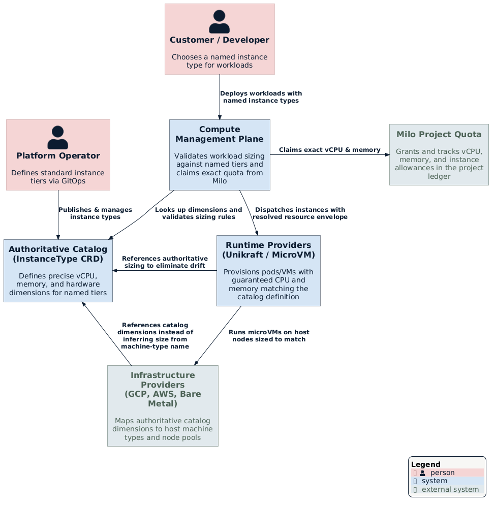
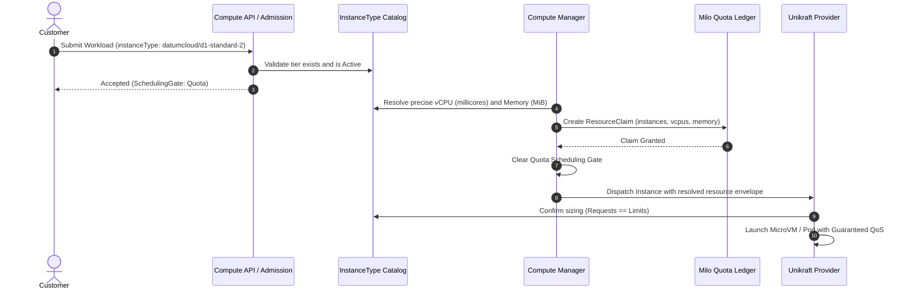

# Authoritative Instance-Type Resource Catalog

**Issue:** [datum-cloud/compute#137](https://github.com/datum-cloud/compute/issues/137)  
**Status:** Draft  
**Related:** [Quota Enforcement Across Deployment Modes](../quota-enforcement/README.md) · [Runtime Classes](../runtime-classes/README.md) · [Federated Deployment Scheduling](../federated-deployment-scheduling.md)

---

## Summary

When a customer configures a compute workload on Datum, they choose how much computing power it needs by selecting a standard instance type (such as `datumcloud/d1-standard-2`). Today, the platform has no single authoritative definition of what an instance type actually provides:

- Sizing is implied across independent components: the management plane hardcodes numbers to claim tenant quota, runtime providers (like `unikraft-provider`) hardcode numbers to size downstream Pods and microVMs, and infrastructure providers translate names directly into cloud machine types.
- These definitions are synced only by comments and good intentions. They will drift. When they drift, a customer might be charged for 2 vCPUs, their quota ledger reflects 2 vCPUs, but the running microVM only receives 1 vCPU — or vice versa.
- Adding or modifying an instance type currently requires coordinated changes and binary rebuilds across multiple repositories.

This enhancement establishes a **single authoritative, declarative instance-type catalog** across Datum Compute. 

Instead of hardcoding sizes in Go across separate repositories, named instance types are defined once as declarative platform resources (`InstanceType`). Every layer — admission validation, quota accounting, runtime provisioning, and infrastructure mapping — consumes this single catalog. What a customer requests, what quota reserves, and what the runtime provisions are guaranteed to match.

---

## Motivation

The resource envelope (vCPU, memory, and future dimensions like storage or GPUs) is the core product contract between Datum and its users. That contract must be declared authoritatively, inspected easily by users and automated tools, and enforced consistently at every stage of execution.

### Goals

- **Single source of truth:** Define named instance types once in an authoritative, cluster-scoped resource (`InstanceType`) that all subsystems read.
- **Zero drift across subsystems:** Ensure that the CPU and memory accounted for in Milo quota claims match the exact resource requests and limits applied to running Pods and microVMs.
- **Dynamic catalog management:** Enable platform operators to add, update, or deprecate instance tiers declaratively (e.g. via GitOps) without recompiling controller binaries or redeploying providers.
- **Discoverability & tooling:** Provide human operators, developer CLIs (`datumctl`), and AI coding assistants a queryable API to discover supported instance types and sizing constraints dynamically.
- **Extensible resource dimensions:** Design the catalog schema to accommodate future dimensions (such as local SSD/ephemeral storage, GPU types, and network bandwidth) without breaking existing definitions.

### Non-Goals

- **Custom / arbitrary sizing policies:** Workloads requesting non-standard resource dimensions outside the catalog (along with ratio guardrails and governance policies) are intentionally deferred to a future enhancement. The catalog schema is designed to leave architectural room for custom sizing without blocking the consolidation of named tiers.
- **Live in-place resizing:** Changing the vCPU or memory of a running instance without recreation. (Dynamic vertical scaling is a separate roadmap item).
- **Overriding underlying hardware realities:** If a physical cell or cloud region lacks bare-metal or VM types capable of hosting a specific tier, the scheduler respects those placement constraints rather than forcing an impossible placement.

---

## Proposal

### Where the Catalog Fits

The authoritative catalog sits at the foundation of the Compute control plane. It acts as the definitive contract for all predefined instance types:


*(Source: [architecture-context.puml](./architecture-context.puml))*

1. **Platform Operators** define available `InstanceType` resources via GitOps.
2. **Customers and Developers** select standard types (e.g. `d1-standard-2`) in their Workload specifications.
3. **Compute Management Plane** validates requests against the catalog and files an accurate `ResourceClaim` with the Milo project quota ledger.
4. **Runtime Providers (`unikraft-provider`)** reference the same catalog dimensions to configure the microVM / Pod with matching Guaranteed QoS limits.
5. **Infrastructure Providers** map catalog dimensions to appropriate host node pools.

### User Stories

- **Standard Tier Deployment:** A developer specifies `instanceType: datumcloud/d1-standard-2`. Compute looks up the catalog, confirms it provides 1 vCPU and 2 GiB RAM, claims exactly that against the project's quota, and passes the instance to the Unikraft provider, which spins up a microVM with identical guarantees.
- **Operator Introduces a New Tier:** The platform team decides to offer a memory-optimized tier (`datumcloud/m1-standard-4` with 2 vCPUs and 16 GiB RAM). They apply a new `InstanceType` manifest to the cluster. Instantly, validation accepts it, `datumctl` lists it, and workloads can schedule it without any code releases.
- **Quota & Billing Confidence:** An operator auditing tenant usage observes that the project's quota ledger matches the sum of active instance allocations bit-for-bit, eliminating hidden billing leaks or over-commit surprises.

---

## How It Works

### Sizing Lifecycle Flow



---

## Design Details

### 1. Authoritative `InstanceType` CRD

The primary catalog entry is defined as a cluster-scoped Custom Resource Definition: `InstanceType` (`compute.datumapis.com/v1alpha`).

```yaml
apiVersion: compute.datumapis.com/v1alpha
kind: InstanceType
metadata:
  name: datumcloud-d1-standard-2
  labels:
    compute.datumapis.com/tier: standard
spec:
  # Human-friendly display name and description
  displayName: "Standard 2"
  description: "General purpose tier with balanced compute and memory"

  # Core resource dimensions
  resources:
    cpu: "1000m"          # 1 vCPU (expressed as standard k8s quantity)
    memory: "2048Mi"       # 2 GiB RAM
    # Room for future dimension expansion:
    # ephemeralStorage: "20Gi"
    # gpu:
    #   count: 1
    #   model: "nvidia-l4"

  # Lifecycle management declared by operator
  lifecycle:
    phase: Active                     # Active | Deprecated | Disabled
    replacementInstanceType: ""        # Optional successor tier (e.g., datumcloud/d2-standard-2) when Deprecated or Disabled

  # Default selection when a workload omits instanceType
  default: true

status:
  # Observed status reported by the controller
  conditions:
    - type: Ready
      status: "True"
      lastTransitionTime: "2026-09-18T12:00:00Z"
```

#### Lifecycle Phases (`spec.lifecycle`)

The operator manages tier sunsetting through `spec.lifecycle`:

- **`Active`**: The instance type is available for all new and existing workloads.
- **`Deprecated`**: The tier is being phased out. Existing running instances continue undisturbed (and can scale down), but new workload deployments are rejected at admission with an actionable message pointing to `replacementInstanceType`.
- **`Disabled`**: The tier is decommissioned (e.g., physical host hardware retired). Both new deployments and restarting instances are blocked, and admission reports an error directing the user to update their specification to `replacementInstanceType`.

> [!NOTE]
> Whenever an `InstanceType` transitions into a `Deprecated` or `Disabled` phase, a warning condition is raised in **`workload.status.conditions`** (such as `InstanceTypeDeprecated` or `InstanceTypeDisabled`) on all workloads referencing that tier. Following standard Kubernetes condition conventions, this gives developers, CLI dashboards, and deployment pipelines immediate visibility alongside the recommended migration target:
> ```yaml
> status:
>   conditions:
>     - type: InstanceTypeDeprecated
>       status: "True"
>       reason: InstanceTypeDeprecated
>       message: "InstanceType 'datumcloud/d1-standard-2' is deprecated; please migrate to 'datumcloud/d2-standard-2'."
>       lastTransitionTime: "2026-09-18T16:00:00Z"
>       observedGeneration: 2
> ```


### 2. How Workloads Express Sizing

Users configure sizing in their Workload or WorkloadDeployment manifests by referencing the named catalog tier:

```yaml
apiVersion: compute.datumapis.com/v1alpha
kind: Workload
metadata:
  name: web-api
spec:
  template:
    spec:
      runtime:
        class: unikraft
        resources:
          instanceType: datumcloud/d1-standard-2
```

If `instanceType` is omitted, the platform applies the default `InstanceType` designated with `spec.default: true` (e.g. `datumcloud/d1-standard-2`).

### 3. Quota and Downstream Provider Alignment

- **Management Plane Quota Claim:**
  When `InstanceReconciler` processes the Instance:
  1. It resolves the exact CPU millicores and Memory MiB using the authoritative `InstanceType` catalog entry.
  2. It submits a `quotav1alpha1.ResourceClaim` to Milo containing:
     - `compute.datumapis.com/instances: 1`
     - `compute.datumapis.com/vcpus: <resolved_millicores>`
     - `compute.datumapis.com/memory: <resolved_mib>`
  3. The `Quota` scheduling gate remains on the Instance until Milo confirms the claim.

- **Downstream Runtime Provider (`unikraft-provider`):**
  1. Waits for all scheduling gates (including `Quota`) to clear.
  2. Rather than relying on a separate, hardcoded local copy of instance types, the provider uses the resolved sizing stamped on the `Instance` (or queries the synchronized `InstanceType` catalog).
  3. Configures the downstream Kubernetes Pod container with:
     - `Requests[cpu] == Limits[cpu] == resolvedCPU`
     - `Requests[memory] == Limits[memory] == resolvedMemory`
  4. This provides a **Guaranteed QoS class** and ensures the running microVM exactly reflects what the quota ledger reserved.

- **Infrastructure Provider Machine-Type Mapping (`infra-provider-gcp` and equivalents):**
  Today, an instance type's size is only *implied* by its mapping to a cloud machine type (e.g. `datumcloud/d1-standard-2` → GCP `n2-standard-2`); nothing declares that the two actually match. To close this gap:
  1. Each `InstanceType` carries a `status.providerMappings` (or an equivalent per-provider annotation) listing, per infrastructure provider, the underlying machine type / node pool selector that satisfies that tier's `spec.resources`.
  2. Infrastructure providers resolve the target machine type by reading this mapping from the catalog rather than re-deriving it from the `InstanceType` name or hardcoding a name-to-machine-type table locally.
  3. A validating admission or reconciler check flags any `InstanceType` whose declared `spec.resources` (vCPU/memory) don't fit within the capacity of its mapped machine type for a given provider, catching drift between the catalog's promised envelope and what the underlying hardware actually offers *before* it reaches a customer workload.
  4. Where a cell or region lacks a machine type capable of satisfying a tier, the provider mapping is simply absent for that provider/region, and the scheduler treats the tier as unplaceable there (consistent with the "Overriding underlying hardware realities" non-goal above).

  This gives infrastructure providers the same guarantee as the quota and runtime paths: the machine type backing an instance is derived from the authoritative catalog, not re-implied from a name.

---

## Future Direction: Custom Sizing

Supporting bespoke sizes outside predefined named types (e.g. specifying arbitrary CPU/memory for workloads with unusual resource footprints) is an important next step. 

As outlined in [datum-cloud/compute#137](https://github.com/datum-cloud/compute/issues/137), custom sizing introduces distinct governance challenges that will be tackled in a dedicated enhancement:

- **API Surface:** Defining how custom sizes are requested (e.g., explicit per-container requests/limits vs. a dedicated `custom` instance type syntax).
- **Governance & Guardrails (`InstanceSizingPolicy`):** Enforcing boundary constraints such as minimum/maximum allocations, allowed step granularity (e.g., 250m CPU, 256MiB RAM), and valid memory-to-CPU ratios (e.g., 1:1 up to 1:8) to prevent physical node fragmentation.
- **Provider Readiness:** Ensuring hypervisors and cloud machine types can satisfy custom shapes across all physical deployment locations.

The `InstanceType` resource designed here acts as the stable catalog baseline that custom sizing can cleanly build on.

---

## Risks and Mitigations

| Risk | Impact | Mitigation |
| :--- | :--- | :--- |
| **Catalog Drift During Transition** | Older provider binaries might not recognize newly introduced `InstanceType` CRDs. | Providers read resolved sizing directly from the `Instance` resource contract or use a shared client package. A fallback validation webhook ensures unsupported sizes are blocked early. |
| **Catalog Availability in Edge Cells** | If an edge cell cluster is disconnected from the management plane, it might miss catalog updates. | `InstanceType` resources are cluster-scoped and replicated to edge cells via the existing federation mechanism (Karmada/GitOps). |
| **Deprecation of Active Tiers** | Removing an instance type could break existing workloads attempting to restart or scale. | `InstanceType` lifecycle supports `spec.lifecycle.phase: Deprecated` with an explicit `replacementInstanceType`. Deprecated types allow existing instances to run and scale down, but reject new workload deployments while directing users to the replacement. |

---

## Drawbacks

- **Increased API Surface:** Introducing the `InstanceType` CRD creates an additional resource to document, validate, and RBAC-protect compared to an internal Go package. However, the operational flexibility, GitOps friendliness, and drift elimination far outweigh this cost.
- **Migration Effort:** Runtime providers like `unikraft-provider` will need to update their dependency pins and replace static local catalogs with the authoritative catalog client.

---

## Alternatives Considered

- **Retaining Static Go Packages Across Repositories:**  
  *Rejected.* While exporting `pkg/instancetype` from `compute` improves on duplicate maps, it still requires coordinated Go dependency updates and binary redeployments whenever an instance tier is added or modified.
- **Relying on Cloud Machine Type Names (e.g., GCP `n2-standard-2`):**  
  *Rejected.* Datum Compute abstracts heterogeneous execution targets (Unikraft unikernels, container runtimes, bare-metal nodes, and multiple cloud vendors). Tying platform instance types to a single cloud provider's nomenclature breaks portability and leaks vendor specifics to customers.
