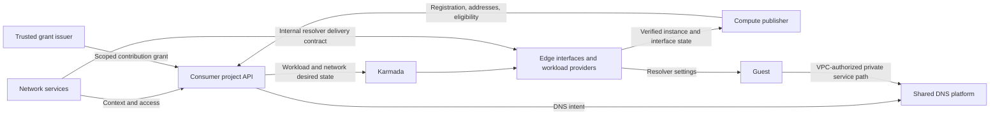

# Internal DNS for Compute instances

Tracking issue: [Internal DNS for Galactic VPC](https://github.com/datum-cloud/enhancements/issues/921).

- [Summary](#summary)
- [Motivation](#motivation)
  - [Goals](#goals)
  - [Non-Goals](#non-goals)
- [Proposal](#proposal)
  - [User stories](#user-stories)
  - [Risks and mitigations](#risks-and-mitigations)
- [Design Details](#design-details)
  - [Integration boundaries](#integration-boundaries)
  - [Names and search domains](#names-and-search-domains)
  - [Resolver configuration](#resolver-configuration)
  - [Record publication](#record-publication)
  - [Lifecycle and health](#lifecycle-and-health)
- [Production Readiness Review Questionnaire](#production-readiness-review-questionnaire)
- [Implementation History](#implementation-history)
- [Drawbacks](#drawbacks)
- [Alternatives](#alternatives)
- [Infrastructure Needed](#infrastructure-needed)

## Summary

Compute instances attached to a virtual private cloud (VPC) receive private DNS
names and resolver settings automatically. Compute publishes each instance's
private addresses to the internal DNS platform. Users can reach instances by
name without selecting a DNS zone or managing address records.

## Motivation

Instance addresses change as workloads scale, restart, or move. Automatic names
let users identify individual instances without maintaining address lists.
Resolution must remain isolated to the authorized VPC, including when VPCs use
overlapping addresses or private zone names.

### Goals

- Assign an instance identity name within each attached VPC's managed namespace.
- Resolve short instance names within the resource's namespace.
- Configure guest resolvers from verified network-interface settings.
- Publish IPv4 and IPv6 host addresses only while their network attachment is valid.
- Bound stale answers when instances disappear or publishers lose connectivity.

### Non-Goals

- Workload-level service discovery and application health policies.
- Public DNS publication, custom per-instance zone selection, and DNS serving engines.
- Supporting several managed DNS contexts within one guest in the initial release.

## Proposal

Every VPC with managed DNS enabled uses `datum.internal` as its default domain. DNS
manages a separate zone within each VPC's context. Compute reserves an instance
name beneath its resource namespace. The name remains stable for that instance's
lifetime; a replacement instance receives a distinct identity. Additional names
can follow the VPC's DNS naming policy without adding a zone choice to each
Compute resource.

Workload providers apply the resolver settings supplied by network services.
DNS publication and guest resolver configuration have separate status from
Compute readiness so users can distinguish naming problems from runtime failures.

### User stories

A user attaches a workload to a VPC and queries an instance's assigned name
from another instance in that VPC:

```console
$ cat /etc/resolv.conf
nameserver fd53::53
search production.datum.internal datum.internal
$ dig +search +short A web-01-k7m2
10.20.0.10
$ dig +short AAAA web-01-k7m2.production.datum.internal.
fd20::10
```

Instance names and addresses are illustrative; `datum.internal` is the proposed shared
default domain. DNS supplies the canonical name; consumers do not construct it
from a workload display name.
The example resolver file describes effective settings; runtimes can apply them
through their native resolver configuration. `dig` requires
[`+search`](https://bind9.readthedocs.io/en/stable/manpages.html#dig-dns-lookup-utility)
to use the configured search list.

When an address is released, subsequent answers omit it after withdrawal and
client-cache expiry. An application failing its readiness check does not remove
the instance identity name, which can still support diagnostics.

### Risks and mitigations

- Cross-VPC publication: pin project, VPC, context, and registration lifetimes;
  authorize publishers through scoped grants.
- Stale addresses: require fresh network eligibility observations and preserve
  their deadlines through replication, retry, and restart.
- Incorrect guest resolution: apply only verified, unexpired settings and reject
  unsupported combinations of managed contexts across interfaces.

## Design Details

### Integration boundaries



Compute uses authenticated project clients for publication. It identifies the
VPC's context through trusted project and Network UIDs, matching the
`DNSResolverContext.spec.consumerID` contract. DNS does not read Compute objects
to determine addresses or health.

Network services own resolver contexts, regional access, and interface DNS
settings. Galactic provides the authorized private service path. DNS owns zones,
name validation, publication status, and shared query serving. Compute does not
create access bindings or select serving replicas.

See the [DNS architecture proposal](https://github.com/datum-cloud/dns-operator/pull/229),
[VPC DNS integration proposal](https://github.com/datum-cloud/network-services-operator/pull/589),
and [Private Service Connect design](https://github.com/datum-cloud/galactic/blob/main/docs/enhancements/networking/private-service-connect/README.md)
for these contracts.

### Names and search domains

Use `<allocated-instance-name>.<resource-namespace>.datum.internal` for instance
identity in every VPC. The resource namespace is the customer-visible project
namespace, not a mapped federation or edge namespace. VPC and project identifiers
do not appear in the default domain.

For a guest in `production`, try `production.datum.internal` before `datum.internal`.
This resolves short instance names locally and supports
VPC-scoped names without a product prefix. Use a fully qualified name to select
another namespace unambiguously. Namespace names organize resolution; VPC access
authorization provides the network isolation boundary.

Two VPCs can resolve `web-01-k7m2.production.datum.internal` to different addresses.
The authorized DNS context selects the zone before lookup and cache access;
matching domain names do not share records or grant access across VPCs. An
instance attached to several VPCs uses the same allocated label in each context,
with only that VPC's addresses in its answers.

Network services supply the managed domain and approved additional search domains.
Compute providers prepend the guest's resource namespace and report the effective
ordered list. Associating a private zone does not automatically add it to the
search list. Bound list size and qualify resolver search order across runtimes.
The consistent default domain, namespace-aware naming, and search contract
require joint DNS and network services API review.

### Resolver configuration

`NetworkInterface` is a public API. Its proposed read-only DNS status exposes
resolver addresses, search domains, and configuration readiness. Customers
select the network; they do not supply DNS authorization or renewal values.
This selected-field example includes proposed controller-written status:

```yaml
apiVersion: networking.datumapis.com/v1alpha
kind: NetworkInterface
metadata:
  name: web-01-eth0
  namespace: production
spec:
  network:
    name: application
  interfaceName: eth0
status:
  # Report effective settings without exposing internal authorization state.
  dns:
    # Galactic exposes this well-known address inside the authorized VPC.
    nameservers: ["fd53::53"]
    # Resolve resource-namespace names before VPC-scoped names.
    searches:
      - production.datum.internal
      - datum.internal
  conditions:
    # The provider reports success after applying authorized settings to the guest.
    - type: DNSConfigured
      status: "True"
      reason: ResolverConfigured
      lastTransitionTime: "2026-10-09T20:00:00Z"
```

Network services deliver authorization through a separate, access-restricted
provider contract bound to the project, interface, and VPC lifetimes. That
contract carries source references, fencing epochs, renewal sequences, and
expiry deadlines. These fields do not belong in the public interface's spec or
status. Public DNS status reports observed configuration; it cannot authorize
provider actions.

Providers apply current, authorized settings and report `DNSConfigured` only
after successful application. They reconcile updates and expiry and reject
stale revisions. Resolver failure must not send private names to a public
resolver. The internal delivery schema and runtime-specific guest configuration
mechanism require joint review with network services before implementation.

### Record publication

Compute creates one registration per instance and VPC, using the managed zone
reported by the matching DNS context. Allocation ties the name to the immutable
Instance UID; name reuse cannot adopt another instance's registration.

A trusted grant issuer authorizes the Compute publisher's authenticated subject
and source-cluster identity for the registration, record types, and owner name.
The runtime publisher cannot issue its own `DNSContributionGrant` or authorize
resolver access. Project authorization and DNS admission enforce both boundaries.

These examples use the proposed DNS API. UIDs, generations, and times are
illustrative. Controllers write the resources; `status` shows controller output.

```yaml
apiVersion: dns.networking.miloapis.com/v1alpha1
kind: DNSRegistration
metadata:
  name: instance-web-01
spec:
  # Select the context's DNS-allocated managed zone and pin its lifetime.
  dnsZoneRef:
    name: managed-application
    uid: 55555555-5555-4555-8555-555555555555
  # Reserve the allocated instance name within its resource namespace.
  name: web-01-k7m2.production
  recordTypes: [A, AAAA]
  # Publish addresses only under a current eligible contribution.
  publicationPolicy: EligibleContributions
  ttlSeconds: 30
status:
  # DNS-owned output used to display the assigned name to consumers.
  canonicalFQDN: web-01-k7m2.production.datum.internal
---
apiVersion: dns.networking.miloapis.com/v1alpha1
kind: DNSRecordContribution
metadata:
  name: web-01-eth0
spec:
  # Pin the reserved name and its publication policy generation.
  registrationRef:
    name: instance-web-01
    uid: 66666666-6666-4666-8666-666666666666
    generation: 1
  # Reference authorization issued separately from the runtime publisher.
  grantRef:
    name: web-01-compute
    uid: 77777777-7777-4777-8777-777777777777
    generation: 1
  # Include only private host addresses allocated and programmed for this VPC.
  recordSets:
    - recordType: A
      records:
        - name: web-01-k7m2.production
          ttl: 30
          a:
            content: 10.20.0.10
    - recordType: AAAA
      records:
        - name: web-01-k7m2.production
          ttl: 30
          aaaa:
            content: fd20::10
status:
  # Compute-owned observation of this contribution's current spec.
  observedGeneration: 1
  # Echo the DNS-issued grant epoch and advance the observation sequence.
  writerEpoch: 3
  sequence: 18
  eligible: true
  reason: NetworkInterfaceProgrammed
  # DNS preserves this deadline and withdraws expired contributions locally.
  validUntil: "2026-10-09T20:01:00Z"
```

Compute renews observations from the authoritative project Instance and verified
interface state. Federation and edge copies retain source lifetime identity;
their locally assigned UIDs cannot establish publication authority. Status writes
preserve DNS-owned fields. Retries cannot extend an observation's deadline.

### Lifecycle and health

Instance identity eligibility requires a live Instance and allocated, programmed
private host addresses. Public addresses and delegated prefixes are excluded.
Each interface contributes only addresses from its own VPC.

Address release, network deprogramming, or instance deletion triggers a
higher-sequence ineligible observation and cleanup. Project-side owner references
and bounded leases cover interrupted cleanup. Serving agents enforce expiry
during publisher outages; client caches remain bounded by the advertised TTL.

Workload service discovery needs a separate registration and explicit application
eligibility policy. It must withdraw unhealthy endpoints and accept recovery
only from a fresh observation. That capability requires a separate Compute API
proposal before implementation.

## Production Readiness Review Questionnaire

### Feature Enablement and Rollback

Use the default-off `InternalDNSPublishing` feature gate for the publisher.
Provider application of managed resolver settings requires a separate rollout
control. Disabling publication stops renewals; records expire, and applications
using their names can lose resolution. Reenabling requires fresh observations.
Test both controls independently.

### Rollout, Upgrade and Rollback Planning

Start with opted-in projects and supported single-context guests. Extend the
shared Kubernetes end-to-end environment with actual Compute publishers and
providers. Require two isolated VPCs with overlapping names and addresses, UDP
and TCP queries from guests, renewal stability, address changes, deletion,
publisher outages, grant revocation, stale replay, and restart coverage.
Test the same default domain and hostname with different answers across VPCs,
equal short names in different namespaces, search precedence, fully
qualified queries, and explicit additional-zone search configuration.
Qualify guest configuration per runtime and mixed controller versions before
enabling production. These are release criteria, not validation claims.

### Monitoring Requirements

Expose assigned names and DNS publication conditions through Instance status;
the exact Compute status schema requires API review. Track publication lag,
renewal failures, withdrawal delay, and guest configuration failures without
per-instance metric labels. Set latency and withdrawal targets before release.

### Dependencies

Project APIs and scoped authorization support publication. Network services,
Galactic, and the DNS fleet support resolver access. API outages stop fresh
observations; installed records and access remain subject to their original
deadlines. DNS errors requeue independently of Compute runtime readiness.

### Scalability

Budget registrations per instance/VPC and contributions per interface. Measure
project API renewal load, controller queues, and grant provisioning at fleet
scale. Spread renewals with jitter and bound concurrent project operations.

### Troubleshooting

Trace the Instance and VPC lifetimes through context, registration, grant, and
contribution status. Check current network eligibility and deadlines, then
compare inherited settings with guest configuration and query results.

## Implementation History

2026-10-09: Compute integration enhancement proposed.

## Drawbacks

Publication adds project API traffic and freshness coordination. DNS outages can
interrupt applications that depend on assigned names despite a healthy runtime.

## Alternatives

User-managed records require consumers to track instance address changes.
Automatic publication keeps that lifecycle with Compute.

## Infrastructure Needed

Provision project-scoped publisher credentials, a separate trusted grant issuer,
VPC resolver access, shared DNS capacity, and the local Kubernetes validation
environment. This integration uses shared serving infrastructure across VPCs.
