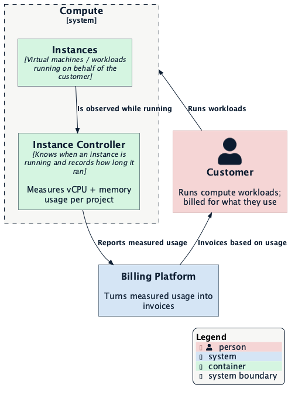
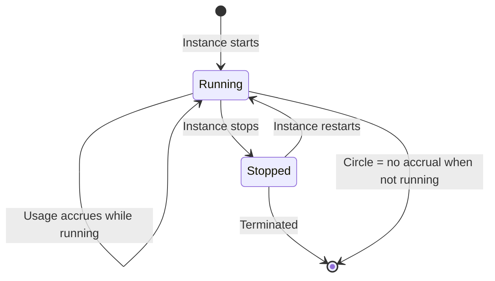

# Per-Second Usage Billing for Compute

- [Summary](#summary)
- [Motivation](#motivation)
  - [Goals](#goals)
  - [Non-Goals](#non-goals)
- [Proposal](#proposal)
  - [Where Compute Fits](#where-compute-fits)
  - [User Stories](#user-stories)
  - [How It Works](#how-it-works)
  - [Risks and Mitigations](#risks-and-mitigations)
- [Design Details](#design-details)
  - [The Instance Controller Is the Metering Point](#the-instance-controller-is-the-metering-point)
  - [What It Tracks per Instance](#what-it-tracks-per-instance)
  - [How the Running Time Becomes Usage](#how-the-running-time-becomes-usage)
  - [Downtime and Crash Recovery](#downtime-and-crash-recovery)
- [Drawbacks](#drawbacks)
- [Alternatives](#alternatives)
- [Production Readiness Review Questionnaire](#production-readiness-review-questionnaire)
  - [Feature Enablement and Rollback](#feature-enablement-and-rollback)
  - [Monitoring Requirements](#monitoring-requirements)
  - [Dependencies](#dependencies)
  - [Scalability](#scalability)
  - [Troubleshooting](#troubleshooting)
- [Implementation History](#implementation-history)
- [Infrastructure Needed](#infrastructure-needed)

## Summary

Today, projects are not billed for the compute they use. This enhancement makes
Compute **meter and hand off exact, per-second usage** — how many vCPUs and how
much memory each customer's workloads actually consumed — to the platform
billing pipeline. Customers get billed for what they truly run, **only while
they are running**, and nothing else.

Compute's job here is narrow and precise: **know how long an instance actually
ran** and report that accurately. It does not set prices, decide who owes what,
or generate invoices — those already live in the platform billing stack. Compute
measures; the billing platform prices and invoices.

## Motivation

Compute currently gives every customer a fixed pool of resources and enforces
limits against it (see [quota enforcement](../quota-enforcement/README.md)), but
nothing records how much of that pool a customer actually used. That means:

- **Customers who run little pay the same as those who run a lot.** Consumption
  is invisible, so usage can't factor into fair, consumption-based billing.
- **There is no accurate, auditable number** beyond a reservation — no count of
  hours used, no basis for usage-based pricing, no way for a customer to see
  their real footprint.

Billing against actual, per-second consumption fixes both. It gives the platform
an accurate, trusted measure of what each project used, for the exact time it
used it — and it gives customers a bill that reflects reality, not a ceiling.

### Goals

- Compute records, for each project, the **actual running time** of its compute
  workloads, counted per second.
- That running time is broken out by resource — **vCPUs** and **memory** — so the
  billing platform can price them (possibly differently) later.
- **Customers are billed only for time they actually ran** — nothing accrues
  while a workload is stopped, and suspension stops accrual entirely.
- The usage Compute reports is **exact and trustworthy**: no double-counting on
  retries, no gaps on faults, and it survives operator and controller restarts.
- The meter definitions Compute emits match what the billing platform expects,
  so usage lands cleanly instead of being rejected.
- Compute's contribution is **hand-off only**. It measures and reports; pricing
  and invoicing stay in the billing platform.

### Non-Goals

- **Pricing, rate cards, or invoices.** Compute does not decide what a vCPU-hour
  costs or bill anyone. It produces usage; the platform turns that into money.
- **Metering things Compute doesn't run.** Billing is for **running** instances
  only — while one is available and running. Reserved-but-idle capacity is not
  billed through this mechanism.
- **Per-second bookkeeping on the wire.** Billing is per-second in *denomination
  and accuracy*, but events are batched, so usage is not a billion little events.
  This keeps the pipeline efficient while billing stays exact.
- **Replacing capacity reservation / quota.** Quota enforcement keeps limiting
  what a project *may* run; this enhancement measures what it *did* run. Both
  coexist.
- **Attributing usage to a billing account.** Compute reports which **project**
  used the resources; mapping project → account (and organizing it by the right
  customer) is the billing platform's job.

## Proposal

### Where Compute Fits

Compute runs customer workloads and knows, moment to moment, what is actually
running. It turns that into usage records and hands them to the platform's
billing pipeline, which meters them against price and sends the result to
billing:

### User Stories

**Consumption-based billing.** A customer runs a small workload for a few hours
and a large one for a week. Their invoice reflects each: measured vCPU and
memory for exactly the time each instance ran — no more, no less.

**Stop means stop.** A customer stops a workload on Friday night. Saturday
onwards accrues nothing. When they start it again Monday, billing resumes from
that point — there is no charge for the gap.

**Suspended costs nothing.** A customer's project is suspended. Instances stop
running, so they stop costing anything, the moment that happens. Billing
resumes only if (and when) the instance actually runs again.

**An operator trusts the number.** Whether an event is retried, a controller
restarts, or write hiccups occur, the usage that lands is the same quantity it
should be — never double-counted, never silently dropped.

### How It Works

**Only running instances bill.** An instance accrues usage while it is running
and stops accruing the moment it leaves the running state (stopped, terminated,
or suspended). Usage is therefore a measure of *actual uptime*, not potential.

**Per second, batched.** An instance's running time is accounted for in seconds,
but recorded in intervals. Any workload that has been running continuously for
the reporting interval reports its accumulated seconds in one record — e.g. a
workload that ran for five minutes reports 300 seconds (times its resource
size) in one event, not 300 separate events.

**What gets recorded, per project:**

- **CPU** — vCPU-seconds: how many vCPUs the instances ran, for how long.
- **Memory** — memory byte-seconds: how much memory the instances used, for how
  long.

**When a workload stops**, the final partial interval is reported up to the
moment it stopped, so the exact time it ran is captured.

The sequence an instance follows over its life:

Nothing about this changes how customers run their workloads. They create,
start, stop, and delete instances exactly as today; measuring usage is
invisible to them.

## Design Details

### The Instance Controller Is the Metering Point

Compute already has a component — the **Instance Controller** — that shepherds
every instance through its life: when it starts, when it becomes available,
when it stops, and when it's removed. Only it sees, centrally, that an
instance is actually **running**. Because it already knows this, it is the
natural and only place to record "how long did this instance run." There is no
separate metering service or per-runtime timers; the controller simply adds
usage accounting wherever it already observes an instance changing state.

### What It Tracks per Instance

For each instance, the controller remembers two things across its lifetime:

- **When the current running stretch began** — the moment the instance became
  available/running, so the clock can start without it having to be observed
  every single second.
- **How far usage has already been reported** — so that on the next report it
  only covers new time, never re-counts what was already handed off.

This bookkeeping belongs to the instance and persists with it, so it survives
the controller itself restarting — metering doesn't lose its place when a
process is recycled. (If the instance is created or its state is reset, the
tracking starts fresh from that point.)

> [!NOTE]
> This tracking is **persisted with the instance** (in the cluster's API
> storage), not held in the controller's memory — so the controller restarting
> or going down never loses it.

### How the Running Time Becomes Usage

On any of the transitions the controller already handles, it turns the tracked
running time into usage:

- **While running**, it reports in intervals: what has accumulated since the
  last report is handed off as one record (CPU + memory for that window).
- **When the instance stops, terminates, or suspends**, it reports the final
  partial interval up to the moment of the transition, then stops — so the
  exact runtime is captured and nothing accrues once it's no longer running.

A signed-off report hand-off that fails is retried for the **same window**, so
no double-count on a retry. The controller therefore never has to be exact at
any single instant — it just needs to be exact about *when the running state
changed*, which it already observes.

### Downtime and Crash Recovery

The metering bookkeeping is stored with the instance itself, not in the
controller's memory, so an outage does **not** erase running time:

- **Controller restarts (or is down briefly).** Instances keep running; on
  restart the controller reads back each instance's markers and bills from the
  last successfully-reported point forward to now. The downtime is recovered
  and billed — nothing is missed, it is simply billed late.
- **Controller is down for a long stretch.** Running time keeps accumulating and
  is all billed on recovery. Correct, but a larger single catch-up window and a
  longer unbilled lag while it is down.

Two genuinely bounded limits apply:

- **The instance is deleted while the controller is down.** Its markers are
  deleted with it, losing the unreported window — bounded to at most one
  reporting interval (default five minutes), because normal operation flushes
  at least that often.
- **A crash between handing usage to the pipeline and recording that it was
  handed off.** On restart that window is re-reported; whether it double-counts
  depends on the pipeline deduplicating by event *content* (quantity) rather
  than only by event *identity* — a check the billing platform must honor.

### Risks and Mitigations

- **Usage events are rejected because the meter isn't registered/declared.**
  Compute's meter definitions and the billing platform's expectations must agree
  one-for-one. Mitigation: Compute ships the declarations and emits consistently
  against them; a mismatch surfaces loudly in monitoring (see
  [Monitoring Requirements](#monitoring-requirements)) rather than silently
  underbilling.
- **A transient write failure could, naively, double-count or drop usage.**
  Mitigation: recording is designed so a retry produces the *same* usage for the
  same interval, and a crash loses at most a bounded, small window. The reported
  number stays trustworthy.
- **Operators can't tell whether usage is flowing.** Mitigation: dedicated
  signals surface usage being emitted and usage being rejected/errored, so "is
  billing working?" is answerable at a glance.
- **This depends on the platform billing pipeline existing and being wired.**
  Compute's side can be developed, gated, and tested independently, and only
  begins reporting once enabled and pointed at the pipeline.

## Drawbacks

- **The platform's first dependency on the billing pipeline for compute.** Until
  it's proven, Compute's usage telemetry is new infrastructure carrying the
  billing path. This is mitigated by shipping behind a feature gate and
  monitoring hand-off closely before broad enablement.
- **Billing is exact, which means it's transactional in nature.** Accurate
  per-second usage is more operational care than a flat capacity charge — but
  it's exactly what fair, consumption-based billing requires.

## Alternatives

- **Bill against reserved capacity (instances *could* run), not actual usage.**
  Rejected. It's the status quo's implicit model and doesn't reward efficiency
  or reflect real consumption; a customer who never starts a workload would
  still be capped-and-charged as if they had. Billing actual usage is the
  differential this enhancement exists to provide.
- **Emit a record every single second.** Rejected. Per-second accuracy does not
  need per-second events, which would impose unreasonable volume and pipeline
  load for no additional billing fidelity (the batching in
  [How It Works](#how-it-works) is exact).
- **Have each runtime separately report and reconcile usage.** Rejected in favor
  of a single, authoritative metering point in Compute, so all runtimes report
  consistently through one path and there is one number to trust.

## Production Readiness Review Questionnaire

> Trimmed to the subsections relevant at alpha, following the precedent of other
> compute enhancements. Beta-targeted subsections (rollout/upgrade/rollback
> planning) are deferred.

### Feature Enablement and Rollback

- [x] Feature gate
  - Usage emission ships behind a feature gate, **off by default**, and is only
    enabled once configured and pointed at the billing pipeline. A deployment
    that hasn't opted in emits nothing.
  - Enabling/disabling takes effect on restart with the changed configuration;
    no control-plane downtime.
  - Rollback is turning the feature off — usage emission stops; no existing
    behavior is affected.

### Monitoring Requirements

- [x] Other (dedicated usage/billing telemetry)
  - Signals distinguish usage being **emitted** (successfully handed off) from
    usage **errored/rejected** (not reaching the pipeline). A rising rejection
    rate with flat emission is the "billing may be silently broken" alarm —
    especially the case where events are rejected for an undeclared meter.

### Dependencies

- The **platform billing pipeline** and the **meter/resource-type definitions**
  it fans out from Compute. Usage is only billable if Compute's declared meters
  and the pipeline's expectations agree, and events actually reach the pipeline.
  If the pipeline is unreachable, emission blocks and surfaces the error (no
  silent underbilling).

### Scalability

- Usage volume is bounded by the **number of running instances** times the
  reporting interval — not by per-second count. A large fleet adds proportionally
  more records, but each instance stays a small, infrequent contributor, so the
  load scales linearly and manageably with fleet size rather than with wall-clock
  seconds.

### Troubleshooting

- **"No usage is landing."** Confirm emission is enabled and configured, and that
  the pipeline is reachable. If events are being rejected, check that Compute's
  declared meters are present and registered on the platform side.
- **"Usage for X looks wrong."** Confirm the instance actually ran for the window
  in question (stopped/suspended time is not billable), and consult the
  emission/rejection signals to rule out a hand-off problem.

## Implementation History

- **Proposed here.** Initial capability and hand-off design.

## Infrastructure Needed

- The **platform billing pipeline** must be available and wired to accept
  Compute's usage records, and Compute's meter/resource-type declarations must be
  registered on the platform side (just-in-time as emission is enabled).
- No new customer-facing surface: measuring usage requires no customer behavior
  change.
