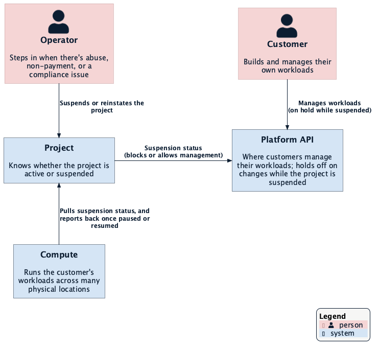
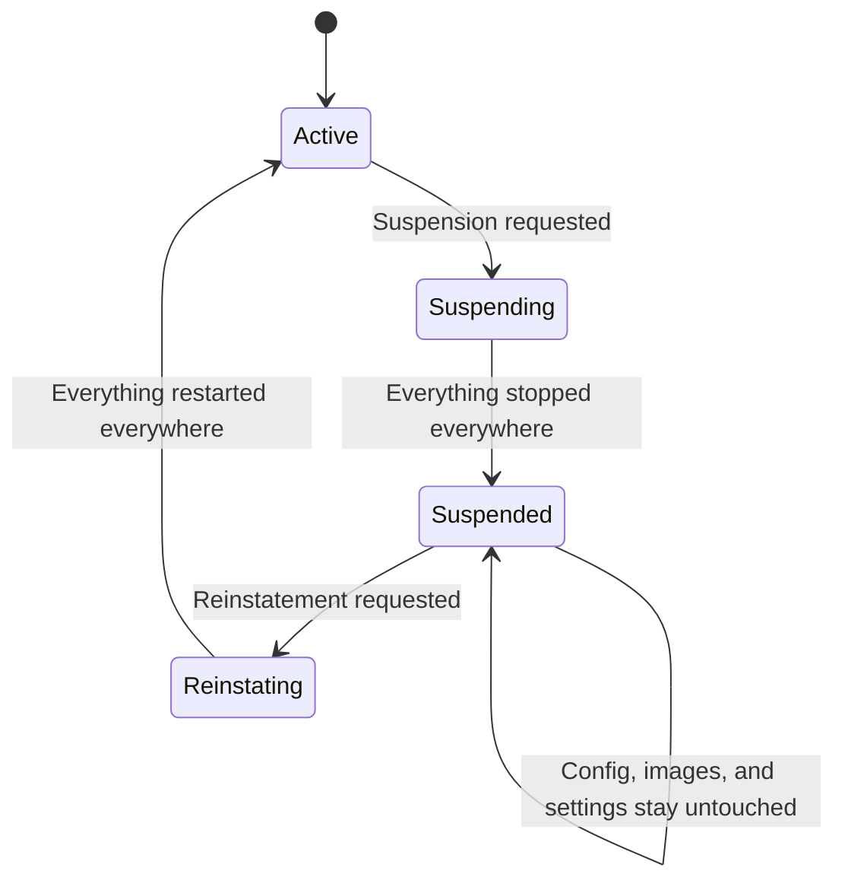
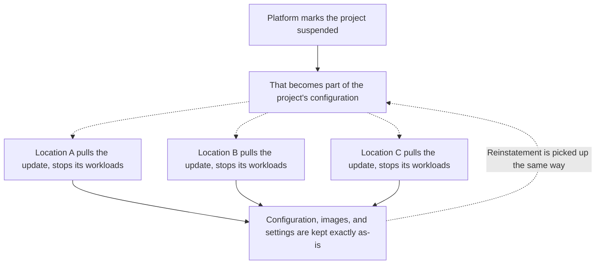

# Project Suspension for Compute

**Issue:** [datum-cloud/compute#182](https://github.com/datum-cloud/compute/issues/182)
**Status:** Draft
**Related:** [Platform-level Project Suspension](https://github.com/datum-cloud/enhancements/blob/enhancement/project-suspension/enhancements/platform/project-suspension/README.md) (the suspension model this document integrates with) · [Federated Deployment Scheduling](../federated-deployment-scheduling.md) (how workloads reach locations)

---

## Summary

When a project is suspended — for abuse, non-payment, or a compliance hold — everything it
runs on Datum Compute needs to stop immediately, and the platform needs a clean way to
bring it back the moment the issue is resolved. Today, compute has no such control: the
only way to stop a running workload is to delete it, which is permanent. That turns every
suspension into a one-way decision and a support ticket.

Compute adds a reversible pause. While a project is suspended, everything it runs stops
running and stops being reachable, everywhere it was running — but nothing about it is
deleted. The moment the project is reinstated, those workloads come back up on their own,
with no re-deploy and no support ticket. "Coming back up" means a clean restart, not
resuming exactly where things left off — see [Non-Goals](#non-goals) for why.

## Motivation

Suspension is meant to be the platform's reversible alternative to deletion across every
managed service — see the [platform-level enhancement](https://github.com/datum-cloud/enhancements/blob/enhancement/project-suspension/enhancements/platform/project-suspension/README.md)
for that broader model. Compute is the first service integrating with it, because it's the
one where "still running" has a real cost and a real abuse impact for every hour it
continues.

### Goals

- While a project is suspended, nothing it runs is running or reachable, anywhere.
- While a project is suspended, no new workloads can start and no changes to its existing
  workloads take effect.
- The moment a project is reinstated, everything that was running before comes back
  automatically — no manual redeploy.
- Suspending or reinstating a project never deletes anything — not the workload
  definitions, not their configuration, nothing.
- Both operators and customers can see, in the activity log, when and why something was
  paused or resumed.
- If compute can't fully carry out a suspension somewhere, it says so rather than quietly
  falling back to deleting anything.

### Non-Goals

- **Preserving exactly what a workload was doing in memory across a pause.** This is the
  most important thing project suspension is *not* doing, and it's a deliberate choice:
  Datum Compute's current focus is stateless workloads, so a paused workload restarts fresh
  rather than resuming mid-computation. Full save-and-restore is a much bigger capability
  tracked separately as part of compute's broader snapshot/scale-to-zero roadmap.
- Keeping existing network connections alive through a pause — those drop, the same as any
  other stop today.
- Deciding *when* or *why* a project should be suspended, and suspending anything short of
  a whole project (individual users, billing accounts, partial/gradual throttling). Those
  decisions and controls belong to the platform and already exist elsewhere; compute only
  reacts once a project-level suspension exists, and never decides to suspend one itself.

## Proposal

### Where Compute Fits

Suspending a project isn't something compute decides on its own. A customer manages their
workloads through the Platform API day to day; when an operator suspends or reinstates a
project, compute picks up on that change and pauses or resumes whatever that project has
running:



### User Stories

**Abuse response.** An operator confirms a project is being used abusively and suspends it.
Within a short, bounded window, everything that project runs — anywhere in the world it was
running — stops and becomes unreachable. Nothing about the project's configuration is
touched. If it turns out to be a false alarm, reinstating the project brings everything
back up exactly as it was, with no work from the customer.

**Billing delinquency with self-service recovery.** A customer's payment fails and their
project is suspended. Their workloads stop running, so they stop costing anything, but
their configuration is preserved untouched. Once they pay their bill, the project is
reinstated and their workloads start back up on their own.

**Compliance hold.** Legal or compliance places a project on hold while an investigation is
open, with only an operator able to lift it. Everything stays paused and nothing can slip
back into service until the operator explicitly reinstates it.

### How It Works

A project moves through the same reversible cycle every time it's suspended and later
reinstated:



A project's workloads typically run across many physical locations at once. Nothing pushes
the suspension out to them — each location already pulls down its project's configuration
on its own, and a suspension is just a change to that configuration. Every location notices
it the same way it notices any other change: it stops what's running there and refuses
anything new. Reinstatement is picked up the same way, in reverse:



A "stop" is pulled the same way any other configuration change is — see
[Federated Deployment Scheduling](../federated-deployment-scheduling.md) for how workloads
actually reach each location today.

### Design Details

Compute already watches a project's status for other reasons today, so suspension rides on
the same mechanism rather than adding a new one: the platform records suspension as a
condition on the `Project` resource, and compute reacts to that condition the same way it
reacts to any other change to a project it's watching. Field and reason names below are
illustrative, not final.

The platform marks a project suspended:

```yaml
apiVersion: resourcemanager.miloapis.com/v1alpha1
kind: Project
metadata:
  name: acme-project
status:
  conditions:
    - type: Suspended
      status: "True"
      reason: NonPayment
      message: "Suspended for non-payment"
      lastTransitionTime: "2026-07-15T18:04:00Z"
```

Compute picks that up and reflects it onto every workload deployment the project has,
anywhere it's running:

```yaml
apiVersion: compute.datumapis.com/v1alpha
kind: WorkloadDeployment
metadata:
  name: my-app
  namespace: acme-project
status:
  conditions:
    - type: Available
      status: "False"
      reason: ProjectSuspended
      message: "acme-project is suspended; workload is stopped"
      lastTransitionTime: "2026-07-15T18:05:00Z"
```

That status flows down one more level, to each individual instance the workload deployment
has running. This is the level where a workload is actually stopped — not just marked
unavailable, but taken out of the running state at each location:

```yaml
apiVersion: compute.datumapis.com/v1alpha
kind: Instance
metadata:
  name: my-app-7f8c9
  namespace: acme-project
status:
  conditions:
    - type: Available
      status: "False"
      reason: ProjectSuspended
      message: "acme-project is suspended; instance is stopped"
      lastTransitionTime: "2026-07-15T18:05:30Z"
```

While a project is suspended, the Platform API also blocks creating new workloads or
modifying existing ones in that project — the exact shape of that protection is still being
worked out.

Reinstatement is the same flow in reverse: the `Suspended` condition on `Project` clears,
compute brings each instance back to a running state and the `Available` condition back on
the workload deployment once it's running again, and the Platform API starts accepting
changes.

### Risks and Mitigations

- **A location can't be reached while a project is suspended, so something keeps running
  there.** Compute should keep retrying until it can confirm the location has actually
  stopped, and report honestly if it can't confirm — never claim a suspension succeeded
  when it didn't.
- **A location can't tell whether a project is currently suspended at all.** Given that
  abuse response is one of the main reasons a project gets suspended, the safer default is
  to hold off on starting anything new until that location can confirm the project's actual
  state, rather than assuming it's fine to keep running.
- **This depends on capabilities the platform hasn't built yet** (the suspension signal
  itself, and the hooks compute uses to receive it). Compute's side of this can't ship ahead
  of those.
- **Customers are surprised that things stop instantly instead of shutting down
  gracefully.** Out of scope to fully solve here, but the activity-log events should make
  "why did this stop" self-service answerable.
- **A suspension gets lifted right as it's being applied, causing something to flap.**
  Compute should always reconcile toward whatever the project's *current* state actually
  is, so a late-arriving pause action naturally does nothing once the project is active
  again.

## Drawbacks

- No save-and-restore (see [Non-Goals](#non-goals)) means customers with long-lived
  connections or in-memory state see a hard stop and a cold restart, not a graceful pause —
  an acceptable tradeoff for stateless workloads today, but not one that would hold up once
  stateful workloads are supported.
- Bringing everything back after a reinstatement takes as long as a normal start would —
  there's no shortcut for getting a large number of workloads back up at once.

## Alternatives

- **Build full save-and-restore first, then suspension on top of it.** Rejected for now —
  it's tied to future stateful-workload support (see [Non-Goals](#non-goals)) and would
  block suspension shipping until it's done. Shipping stop/restart now gets this reversible
  control in place sooner.
- **Just stop routing new traffic to a suspended project's workloads, without stopping them.**
  Rejected — it doesn't actually stop the abuse or the cost; the workloads keep running and
  keep consuming resources, they just stop being reachable, which doesn't meet the goal.
- **Scale everything to zero instances instead of a dedicated stop.** Rejected as the primary
  mechanism — that's really a different capability (scaling workloads down when idle) that
  deserves to be built for its own sake, not repurposed as a side effect of suspension.
